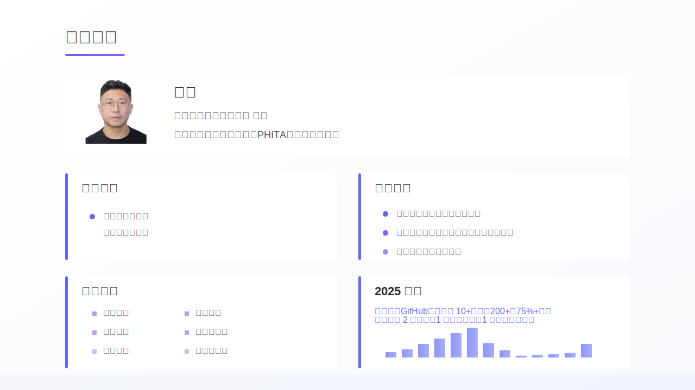
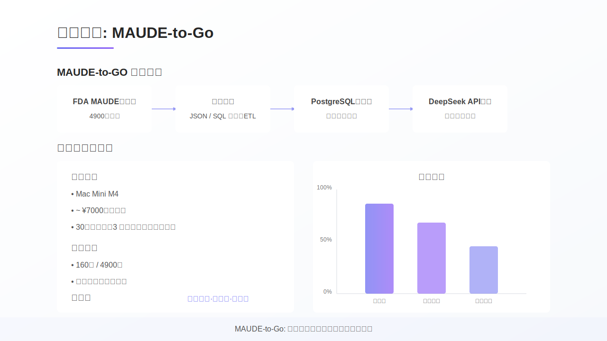
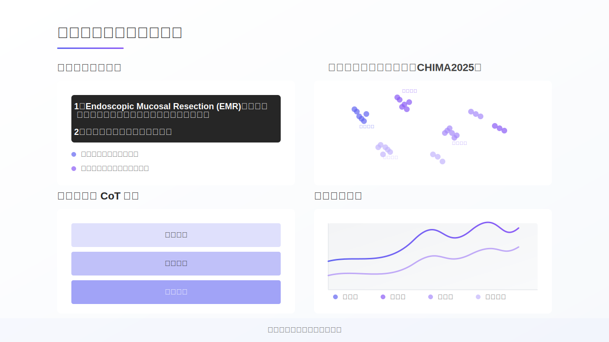
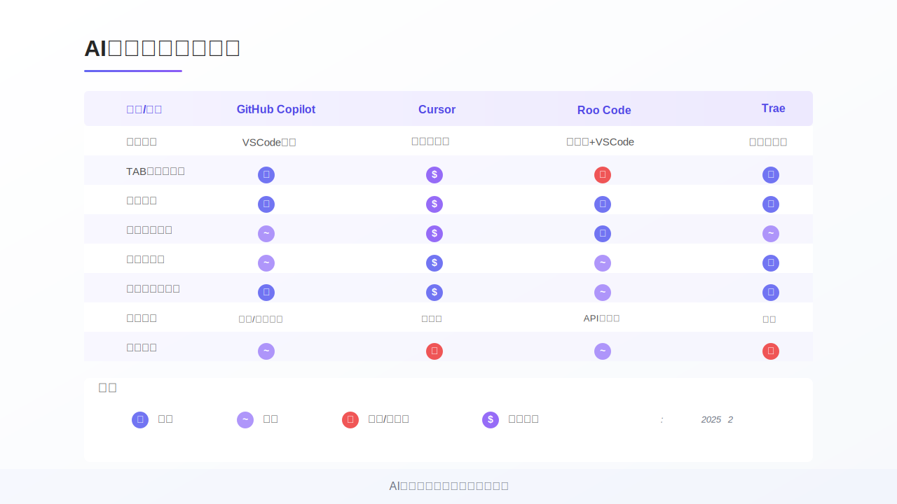
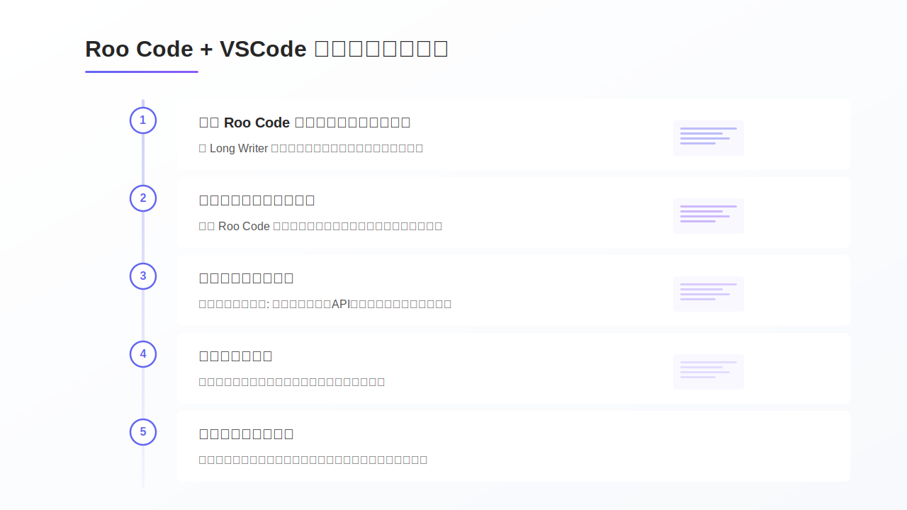
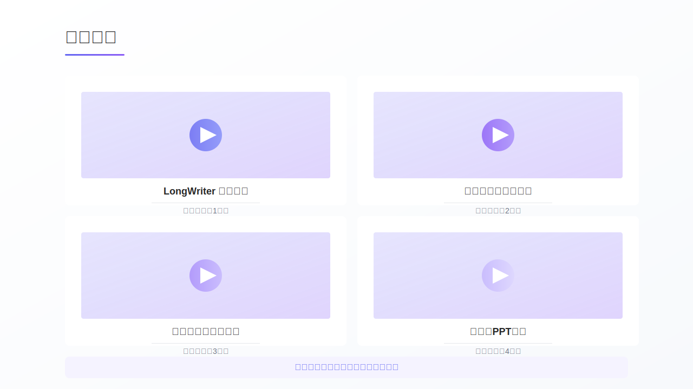
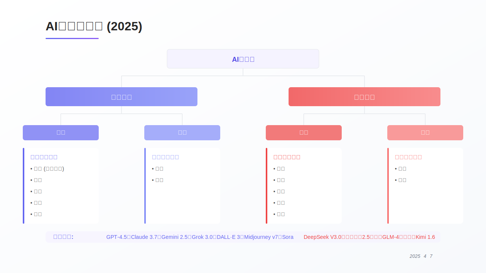
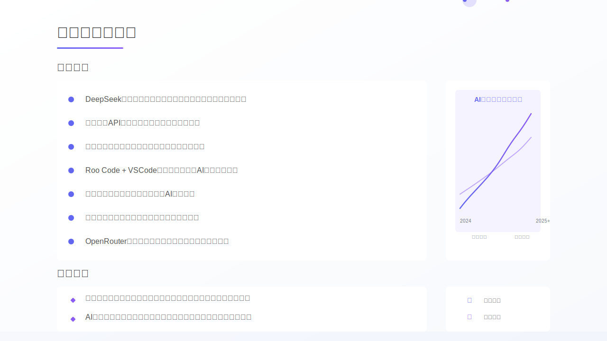

# Lecture Notes

## Slide-01-16-9

### Lecture Notes

## 讲义：基于DeepSeek的生成式AI开发实践

**1. 主题：**

本SVG图表示一个关于“基于DeepSeek的生成式AI开发实践”的演讲或演示的幻灯片。重点在于利用DeepSeek进行生成式AI应用开发，特别是从API集成到长文本生成的过程。

**2. 元素关系：**

*   **标题与副标题：** 主要标题“基于DeepSeek的生成式AI开发实践”概括了演讲的核心内容，副标题“从API集成到长文本生成”则进一步细化了实践的具体范围。
*   **演讲者信息：** 幻灯片包含了演讲者姓名（华磊）、所属机构（忻州师范学院）和院系（计算机系）。
*   **时间信息：** 幻灯片标注了演讲时间段（14:50-15:20）。
*   **底部信息：**幻灯片底部强调了主题“生成式AI应用开发”。

**3. 结构：**

幻灯片采用典型的标题-副标题-演讲者信息的结构。顶部标题点明主题，副标题补充说明，下方提供演讲者信息，底部再次强调主题。

**4. 技术细节：**

*   **SVG结构：** 使用`<rect>`、`<circle>`和`<text>`等基本SVG元素构建。
*   **渐变填充：** 使用`<linearGradient>`定义了背景和强调色的渐变效果，增强视觉效果。
*   **透明度：** 圆圈使用了透明度（opacity）属性，营造柔和的背景效果。
*   **字体样式：** 使用`font-family`、`font-size`、`font-weight`和`fill`属性设置文本样式。

**5. 教学启发：**

*   **实战导向：** 这张幻灯片强调了实践，可以引导学生关注如何将理论知识应用于实际的生成式AI项目开发中。
*   **API集成重要性：** 强调API集成，可以引导学生学习如何利用现有的AI服务，快速构建应用。
*   **长文本生成：** 提示学生关注长文本生成的技术难点和解决方案，例如Transformer模型、文本连贯性等。
*   **DeepSeek生态：** 引导学生了解DeepSeek平台提供的工具和资源，以及如何在实际项目中应用。

## Slide-02-16-9

### Lecture Notes

## 讲义：讲者介绍

**主题：** 介绍讲者的个人信息，包括教育背景、工作经历和研究方向。

**关键关系：**

*   **信息分类：** 讲者信息被组织成几个主要类别：讲者介绍、教育背景、工作经历、研究方向和2025计划。
*   **时间顺序：** 工作经历按照时间先后顺序排列（虽然SVG代码中没有明确的时间信息，但通常的简历会这样组织）。
*   **研究方向的层次结构：** 研究方向包含多个子方向，通过矩形和文字进行关联。

**结构/流程：**

该图呈现了一种静态的信息展示结构，没有明显的流程。信息按照类别分块展示，便于快速浏览。

**技术细节：**

*   **SVG元素：** 使用了矩形 (`rect`)、圆形 (`circle`) 和文本 (`text`) 元素来构建信息展示的布局。
*   **颜色主题：** 使用了渐变色 (`linearGradient`)，主色调为紫色，用于标题和突出显示。
*   **视觉层次：** 使用不同的字体大小和颜色来区分标题和正文，增强视觉层次感。
*   **阴影效果：** 使用 `filter="drop-shadow(...)"` 给矩形添加阴影，增加立体感。

**教学要点：**

*   **信息可视化：** 这是一个典型的个人信息展示案例，强调信息的组织和呈现方式。
*   **设计原则：** 强调了使用颜色、字体和布局来提高信息的可读性和吸引力。
*   **简历设计：** 可以作为简历设计的参考，展示如何用简洁的图形化方式呈现个人信息。
*   **SVG基础：** 可以用来讲解SVG的基本元素和属性，例如矩形、圆形、文本、颜色和阴影。
*   **开源项目：** 提及了GitHub开源项目，可以引出开源文化和协作的话题。

## Slide-03-16-9

### Lecture Notes

## MAUDE-to-Go 讲义

**主题:** MAUDE-to-Go：医疗设备数据处理与智能查询平台

**概念:**  该图展示了 MAUDE-to-Go 平台的工作流程、性能指标和优势。它是一个用于处理和智能查询医疗设备数据的平台，旨在简化数据研究过程。

**流程与关系:**

1.  **数据来源:** 从 FDA MAUDE 数据库获取医疗设备报告 (4900万报告)。
2.  **数据处理:**  通过 JSON/SQL 自动化 ETL 进行数据清洗、转换和加载。
3.  **数据存储:**  将处理后的数据存储在 PostgreSQL 数据库中，并构建混合搜索引擎。
4.  **查询:**  集成 DeepSeek API，支持自然语言查询。

**性能指标与优势:**

*   **快速部署:** 可以在低成本的硬件 (Mac Mini M4) 上快速部署 (30分钟安装)，并快速完成数据研究 (3分钟)。
*   **数据规模:** 支持处理大规模数据 (160万/4900万报告)，并支持全量数据和季度更新。
*   **可靠性:** 平台具有高一致性、低延迟和近实时的特性。
*   **主要收益:** 图表展示了在易用性、时间成本和设备需求方面的收益，易用性和时间成本收益较高，设备需求收益较低。

**技术细节:**

*   使用了 PostgreSQL 数据库和混合搜索引擎。
*   集成了 DeepSeek API 实现自然语言查询。
*   使用了自动化 ETL 流程。

**教学要点:**

*   强调 MAUDE-to-Go 平台在医疗设备数据处理和查询方面的价值。
*   解释每个步骤的具体功能和作用。
*   讨论平台在性能、规模和可靠性方面的优势。
*   分析图表展示的收益，并解释其含义。
*   可以进一步探讨该平台在医疗领域的应用场景。

## Slide-04-16-9

### Lecture Notes

## 自然语言处理与智能数据分析讲义

**主题:** 本SVG图主要展示了自然语言处理(NLP)在智能数据分析中的应用，重点突出了自然语言查询界面和基于思维链(CoT)的分析方法，并强调了可视化和效益。

**关键关系:**

*   **自然语言查询界面**：用户通过自然语言提问，系统进行语义理解和意图提取，自动识别关键词和上下文关联，最终实现查询。
*   **语义聚类和相似度分析**：对数据进行语义上的聚类和相似度分析，涉及事件类型、系统组件、影响范围和解决方案等维度。
*   **基于思维链(CoT)分析**：通过初始查询、后续查询，逐步进行深度分析，最终得到结果。
*   **可视化与效益**：分析结果通过可视化呈现，突出及时性、可重复性、有效性和去中心化等特点，体现分析的效益。

**层级结构/流程:**

1.  用户通过自然语言查询界面输入问题。
2.  系统进行语义理解和分析。
3.  通过思维链(CoT)进行深度分析。
4.  分析结果可视化呈现，并体现效益。

**技术细节:**

*   使用了矩形、圆形、直线和路径等基本SVG元素。
*   通过线性渐变`linearGradient`定义了背景和强调色。
*   `filter: drop-shadow`实现了阴影效果。
*   `opacity`属性用于调整元素的透明度。
*   `transform: matrix()`用于对文本进行变换。

**教学要点:**

*   强调NLP在数据分析中的重要性，特别是自然语言查询的便利性。
*   解释思维链(CoT)分析的概念，以及如何通过多轮查询逐步深入分析。
*   讨论可视化在数据分析结果呈现中的作用，以及如何通过可视化突出分析的效益。
*   介绍SVG的基本元素和属性，以及如何使用SVG创建信息图表。

## Slide-05-16-9

### Lecture Notes

## 讲义：AutoQUEST - 基于LLM的CoT医疗设备安全分析

**主题:** 本讲义主要介绍 AutoQUEST，一个基于大型语言模型 (LLM) 和 Chain-of-Thought (CoT) 方法的医疗设备安全分析系统。该系统旨在提升医疗设备数据的使用效率，并辅助安全监测。

**关键关系:**

*   **研究重要性:** 强调了 FDA MAUDE 数据库的重要性，以及自然语言查询接口在降低分析门槛方面的作用。
*   **创新亮点:** 突出了 AutoQUEST 的核心创新，包括基于 LLM 的 CoT 问题生成、自动化问题验证与优化机制，以及端到端解决方案。
*   **流程:** 展示了 Chain-of-Thought 问题生成与验证流程，包括问题提出、CoT推理、验证、优化、答案生成、反馈整合以及最终结果。

**层级结构/流程:**

该图展示了一个从问题开始，经过 CoT 推理、验证、优化，最终得到结果的流程。流程中包含验证和反馈环节，体现了迭代改进的思想。

**技术细节:**

*   **LLM & CoT:** 系统利用大型语言模型进行 Chain-of-Thought 推理，模拟人类的思考过程，从而提高问题解答的准确性。
*   **数据处理:** 系统能够高效处理非结构化的医疗文本数据，例如医疗设备事件报告。
*   **自动化验证与优化:** 系统具备自动化的问题验证与优化机制，保证输出结果的质量。

**教学启发:**

*   可以结合实际案例，讲解如何利用 AutoQUEST 系统快速识别医疗设备安全隐患。
*   可以探讨 LLM 和 CoT 方法在医疗领域的应用前景，以及可能面临的挑战。
*   强调交互式分析在减少认知负担方面的作用，并鼓励学生思考如何设计更友好的用户界面。
*   可以深入讨论数据清洗到可视化的端到端解决方案，以及其在实际应用中的价值。

## Slide-06-16-9

### Lecture Notes

## 长文本生成流程讲解

**主题:** 本图展示了使用 DeepSeek API 进行长文本生成的典型流程，包括输入、大纲生成、文章生成和输出管理。

**关键关系:**

*   **阶段性流程:** 流程分为三个主要阶段：用户输入与初始化、大纲生成与优化、文章生成与保存。每个阶段包含多个步骤。
*   **依赖关系:** 后续阶段依赖于前一阶段的输出。例如，文章生成依赖于优化后的大纲。
*   **API集成:** DeepSeek API贯穿整个流程，用于大纲生成和文章生成。

**流程结构:**

1.  **用户输入与初始化:** 收集用户提供的参数（标题、字数、体裁/语言），设置环境变量、日志记录和输出目录，并验证 DeepSeek API 密钥和配置模型。
2.  **大纲生成与优化:** 根据用户输入生成文章大纲，包括节点结构和章节划分，并将其存储为JSON格式。对大纲进行验证和优化，包括结构验证、章节优化（合并/拆分）和标题净化。
3.  **文章生成与保存:** 将引言、正文和结论组装成完整的文章。集成 DeepSeek API 以调用模型，处理错误，并进行重试。最后，管理输出，包括保存文件、记录日志和返回结果。

**技术细节:**

*   **DeepSeek API:** 使用 DeepSeek API 进行文本生成。需要验证密钥、配置模型，并处理可能的错误。
*   **JSON格式:** 大纲以 JSON 格式存储，方便程序处理。
*   **重试机制:** 在API调用失败时，使用重试机制来提高系统的稳定性。

**教学要点:**

*   强调长文本生成是一个复杂的过程，需要多个步骤协同工作。
*   解释每个阶段的关键任务和技术细节。
*   讨论如何使用API进行文本生成，并处理潜在的问题。
*   强调大纲在长文本生成中的重要性，以及如何优化大纲以提高文章质量。

## Slide-07-16-9

### Lecture Notes

## AI编程助手功能对比讲义

**主题:** AI编程助手的功能对比与选择

**核心概念:**

*   比较不同AI编程助手（GitHub Copilot, Cursor, Roo Code, Trae）在不同功能上的表现。
*   评估不同工具的集成方式、功能特性、使用成本和隐私安全。
*   帮助开发者根据自身需求选择合适的AI编程助手。

**关键关系:**

*   **功能/工具 vs. AI助手:** 表格的行表示不同的功能，列表示不同的AI助手。表格中的单元格表示该AI助手在该功能上的表现。
*   **功能 vs. 评价:** 不同的功能（如代码补全、代码解释）对应不同的评价等级（优秀、中等、不佳/不支持）。

**结构/流程:**

该图表是一个表格，呈现了AI助手功能的对比。从上到下，依次列出不同的功能，并横向比较不同AI助手在这些功能上的表现。

**技术细节:**

*   使用矩形`rect`创建表格的单元格。
*   使用圆形`circle`和文本`text`来表示评价等级（✓, ~, ✗, $）。
*   使用不同的颜色来区分不同的评价等级。
*   使用了线性渐变`linearGradient`来填充背景和表格头部，增加视觉效果。

**教学要点:**

*   **强调实用性:** 讲解时，应结合实际开发场景，说明不同功能对开发效率的影响。
*   **注意时效性:** 提醒学生图表基于特定时间点，AI助手的功能可能会不断更新。
*   **引导思考:** 鼓励学生结合自身需求，分析不同AI助手的优缺点，选择最适合自己的工具。
*   **解释图例:** 详细解释图例中各个符号的含义，确保学生能够正确理解图表内容。
*   **讨论成本与隐私:** 强调使用成本和隐私安全的重要性，引导学生综合考虑各种因素。

## Slide-08-16-9

### Lecture Notes

## AI编程助手最佳实践与技巧 讲义

**主题:** 本SVG图表展示了AI编程助手的最佳实践与技巧，旨在提高开发效率和代码质量。

**关键关系:** 图表将最佳实践分为四个主要方面，并分别列出了具体的建议：

1.  **指令优化:** 如何更有效地向AI助手发出指令，包括明确指令、提供上下文、分解任务等。
2.  **工作流优化:** 如何将AI助手融入开发流程，例如利用AI创建项目架构、分模块开发、代码审查等。
3.  **代码质量提升:** 如何利用AI助手提高代码质量，包括添加注释、处理错误、生成单元测试、代码重构等。
4.  **问题解决策略:** 如何利用AI助手解决编程问题，包括提供详细错误信息、分步骤解决问题、比较多种解决方案等。

**结构:**  图表采用四象限布局，每个象限代表一个主题。每个主题下都列出了若干条实践建议，使用勾号和叉号区分推荐和不推荐的做法。底部简要提示了工具选择的考虑因素。

**技术细节:**
*   SVG使用矩形、圆形和文本元素构建。
*   使用了线性渐变（linearGradient）来填充背景和矩形，增强视觉效果。
*   使用了 `drop-shadow` 滤镜为矩形添加阴影效果。
*   文本使用了不同的字体、大小和颜色来区分标题和内容。

**教学要点:**

*   强调指令优化是使用AI编程助手的关键，指令越明确，AI的输出质量越高。
*   讲解如何将AI助手融入现有的开发工作流，提高效率。
*   强调AI助手在代码质量保证方面的作用，例如代码审查、单元测试生成等。
*   讨论利用AI助手解决问题时的策略，例如提供上下文、分步骤解决等。
*   引导学生思考如何根据项目需求选择合适的AI编程工具。

## Slide-09-16-9

### Lecture Notes

## 讲义：Roo Code + VSCode 人机协作编程演示

**主题:** 此SVG图示展示了使用Roo Code和VSCode进行人机协作编程的工作流程，以开发"Long Writer"程序为例。

**关键关系:**

*   **时间轴:** 垂直时间轴将整个流程分解为五个关键步骤，每个步骤都与一个编号的圆圈相关联。
*   **步骤描述:** 每个步骤的详细描述都位于时间轴旁边，说明了该步骤的目标和具体操作。
*   **Roo Code 应用:** 每个步骤都明确指出Roo Code在其中的应用方式，强调其在项目各个阶段的作用。
*   **代码示例:** 每个步骤旁边都包含简化的代码片段，暗示了该步骤中涉及的具体代码操作。

**层级结构/流程:**

该图表呈现了一个线性流程，从项目规划开始，到结果展示结束。

1.  项目规划 (架构师模式)
2.  生成目录结构和基础文件 (代码模式)
3.  具体功能实现与集成
4.  测试与文档生成
5.  演示运行与结果展示

**技术细节:**

*   **SVG元素:** 使用矩形、圆形和文本元素来构建视觉效果。
*   **颜色和渐变:** 使用颜色和渐变来区分不同的元素，并增强视觉吸引力。
*   **阴影:** 使用阴影效果来突出显示步骤描述的矩形框，增加立体感。
*   **字体:** 使用不同的字体大小和粗细来区分标题和描述。

**教学要点:**

*   **人机协作编程:** 强调Roo Code在辅助开发过程中的作用，提高开发效率。
*   **模块化编程:** 演示如何将一个大型项目分解为更小的、可管理的模块。
*   **自动化流程:** 突出Roo Code在生成代码、文档和测试方面的自动化能力。
*   **项目生命周期:** 阐述软件开发项目的完整生命周期，从规划到部署。
*   **实际应用:** 通过"Long Writer"程序的例子，说明如何将理论知识应用于实际项目。

## Slide-10-16-9

### Lecture Notes

## 讲义：LongWriter程序开发演示视频

**1. 主题:**  本SVG图示展示了LongWriter程序的开发过程，并提供了相关演示视频的入口。它将整个开发流程划分为四个阶段，每个阶段都对应一个视频。

**2. 关键关系:**
*   每个矩形框代表一个开发阶段，框内包含视频缩略图、标题和阶段描述。
*   点击每个矩形框（实际上是`<a>`标签），可以跳转到对应的视频链接。
*   四个阶段按照顺序排列，暗示了开发的先后顺序。

**3. 层次结构/流程:**
*   整体结构是线性流程，从程序规划到最终的文档生成，依次展示。
*   每个阶段内部，缩略图、标题和描述构成一个小的层次结构。

**4. 技术细节:**
*   使用矩形 (`<rect>`)、圆形 (`<circle>`) 和多边形 (`<polygon>`) 元素构建视觉效果。
*   使用线性渐变 (`<linearGradient>`) 创建颜色效果，例如视频缩略图的背景色。
*   `<a>` 标签用于创建链接，指向视频文件。
*   `drop-shadow` filter 用于增加阴影效果，提升视觉层次感。

**5. 教学要点:**
*   可以用来讲解软件开发的流程管理，强调阶段性成果的重要性。
*   展示如何使用SVG创建交互式内容，例如链接到外部资源。
*   可以作为案例，分析如何使用SVG元素和属性构建复杂的界面。
*   可以引导学生思考如何将类似的设计应用到其他领域，例如产品演示、教程等。

## Slide-11-16-9

### Lecture Notes

## AI大模型分类 (2025) 讲义

**1. 主题：**

本图表展示了2025年AI大模型的分类，主要依据两个维度：地域（国际 vs. 中国）和商业模式（闭源 vs. 开源）。

**2. 关键关系：**

*   **层级关系：** "AI大模型"是顶层概念，向下分为"国际模型"和"中国模型"。每个地域的模型再细分为"闭源"和"开源"两种类型。
*   **分类依据：** 地域和商业模式是主要的分类标准。
*   **特征关联：** 图表中列出了每种类型模型的典型应用领域（如文本、图像、语言、综合等）。

**3. 结构与流程：**

图表呈现了一种树状结构，从总体到具体，依次展示了AI大模型的分类情况。流程上，可以理解为先确定模型的地域来源，再确定其开源/闭源属性，最后了解其擅长的应用领域。

**4. 技术细节：**

*   **SVG元素：** 使用矩形(rect)表示分类框，线条(line)表示层级关系，文本(text)用于标注分类名称和特征。
*   **颜色编码：** 国际模型使用蓝色系，中国模型使用红色系，有助于区分不同地域的模型。 闭源和开源也用了不同深浅的颜色区分。
*   **梯度填充：** 矩形使用了线性渐变(linearGradient)填充，增加了视觉层次感。

**5. 教学要点：**

*   **强调分类标准：** 引导学生思考为什么选择地域和商业模式作为分类标准，以及这些标准对模型发展的影响。
*   **对比不同类型模型：** 比较国际和中国模型在应用领域上的差异，以及闭源和开源模型在发展策略上的不同。
*   **结合实际案例：** 结合图表中列出的知名模型，讲解它们各自的特点和应用场景，帮助学生更好地理解不同类型模型的优势和劣势。
*   **数据时效性：** 强调图表中的数据截至2025年4月7日，提醒学生关注AI大模型领域的快速发展和变化。

## Slide-12-16-9

### Lecture Notes

## 讲义：AI辅助编程的总结与未来展望

**主旨:** 本次讲义总结了AI辅助编程的关键要点，并展望了未来的发展趋势。

**关键要点:**

*   **长文本生成能力:** DeepSeek等模型在长文本生成方面表现出色，适用于学术和商业应用。
*   **工程化API调用:** 稳定的API调用流程对于确保系统的可靠性和可扩展性至关重要。
*   **大纲先行:** 在生成长文本之前制定大纲，可以显著提升文本的结构性和连贯性。
*   **高效开发环境:** Roo Code + VSCode的组合提供了高效的AI辅助开发体验。
*   **指令优化:** 明确的指令优化和工作流程能够提升AI编程的质量。
*   **模型选择:** 国内外大模型各有优势，应根据具体需求进行选择。
*   **模型对比:** OpenRouter可用于非敏感内容的多模型性能对比测试。

**未来展望:**

*   **模型性能提升:** AI模型在长文本连贯性和专业领域知识方面将持续提升。
*   **工具深度集成:** AI辅助编程工具将更深入地集成到开发流程中，提升代码质量和效率。

**趋势可视化:**

*   图表展示了AI模型在生成能力和开发工具方面的发展趋势，预测未来几年将持续增长。
*   图标表示性能提升和工具集成的趋势。

**技术细节:**

*   SVG代码使用`<rect>`, `<circle>`, `<path>`, `<text>`等元素来构建图表和文本。
*   渐变色`linearGradient`用于增强视觉效果。
*   `filter`属性用于添加阴影效果。

**教学要点:**

*   强调AI在辅助编程中的作用，并鼓励学生积极探索和应用。
*   引导学生关注AI模型的发展趋势，并思考如何将其应用于实际项目中。
*   鼓励学生尝试不同的AI辅助编程工具，并选择适合自己的工具。
*   强调指令优化和工作流程的重要性，以提升AI编程的质量。

