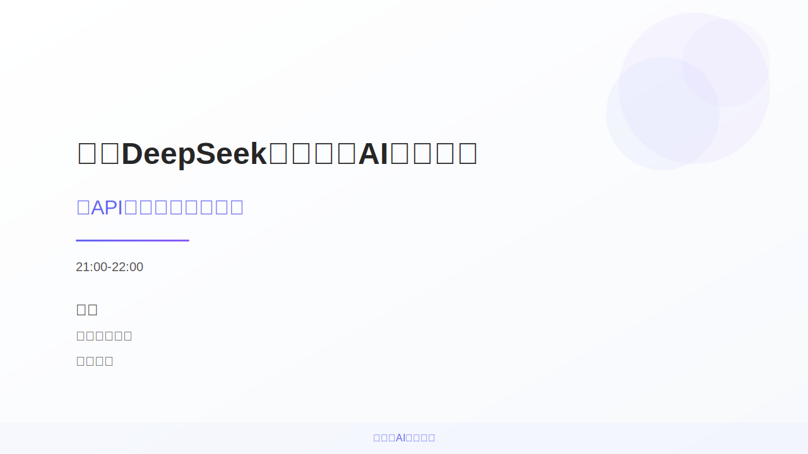

# Lecture Notes

## Slide-01-16-9

### Lecture Notes

## 讲义：基于DeepSeek的生成式AI开发实践

**幻灯片标题:** 基于DeepSeek的生成式AI开发实践

**副标题:** 从API集成到长文本生成

**演讲者:** 华磊

**机构:** 忻州师范学院 计算机系

**时间:** 14:50-15:20

**主题：** 本幻灯片介绍了一场关于基于DeepSeek的生成式AI开发实践的讲座，核心内容是API集成和长文本生成。

**I. 概述 (Introduction)**

*   **幻灯片目的：**  作为讲座的开场，本幻灯片旨在引起观众对使用DeepSeek进行生成式AI应用开发的兴趣。
*   **核心概念:**  本幻灯片涉及以下几个核心概念：
    *   **生成式AI (Generative AI):** 一种人工智能，能够生成新的、原创的内容，例如文本、图像、音频等。
    *   **DeepSeek:**  可以推测为一种AI模型或平台，用于支持生成式AI的开发和应用。
    *   **API集成:**  将DeepSeek提供的应用程序编程接口（API）集成到现有系统或应用中，以便利用其生成能力。
    *   **长文本生成:**  生成长度较长的文本内容，例如文章、报告、小说等。

**II. 幻灯片元素分析 (Elements Analysis)**

*   **背景:** 幻灯片使用渐变色背景，从白色到淡蓝色(#f7f9fc)，营造舒适的视觉效果。
*   **图形元素:**  三个半透明的圆形（#8b5cf6, #6366f1, #a78bfa）位于右上角，作为装饰元素，可能暗示着AI的复杂性和无限可能。
*   **文字内容:**
    *   **标题（“基于DeepSeek的生成式AI开发实践”）:**  使用粗体、较大字号，表明这是幻灯片的核心主题。
    *   **副标题（“从API集成到长文本生成”）:**  使用较小字号，详细说明了演讲的具体内容，即如何通过API集成DeepSeek实现长文本生成。
    *   **时间（“14:50-15:20”）、演讲者（“华磊”）、机构（“忻州师范学院 计算机系”）:**  提供演讲的基本信息。
    *   **页脚文字（“生成式AI应用开发”）:**  位于底部居中，再次强调主题，并可能作为整个系列幻灯片的主题。
*   **强调线:** 一条使用渐变色 (#6366f1 to #8b5cf6) 的短横线位于副标题下方，起强调作用。
*   **矩形:** 底部一个透明的矩形，增加了视觉上的分隔感，并作为页脚的背景。

**III. 关键关系 (Key Relationships)**

*   **DeepSeek 与 生成式AI:**  DeepSeek 是实现生成式AI的工具或平台。 演讲的核心是利用DeepSeek进行生成式AI开发。
*   **API集成 与 长文本生成:** API集成是实现长文本生成的前提。通过集成 DeepSeek 的 API，开发者可以调用其长文本生成功能。
*   **标题 与 副标题:** 副标题是对标题的补充和细化，明确了演讲的具体内容。

**IV. 技术细节 (Technical Details)**

*   **SVG结构:**  幻灯片使用SVG（Scalable Vector Graphics）格式，这是一种基于XML的矢量图形格式，可以保证在高分辨率屏幕上的显示效果。
*   **颜色:**  使用多种颜色，包括 #ffffff, #f7f9fc, #6366f1, #8b5cf6, #a78bfa, #262626, #525252。 主要颜色是紫色和蓝色，营造科技感和专业感。
*   **字体:**  使用 Arial 字体，确保在不同平台上的兼容性。
*   **透明度 (opacity):**  圆形元素使用了透明度，使视觉效果更加柔和。
*   **渐变 (linearGradient):** 背景和强调线使用了线性渐变，增加了视觉层次感和美观性。
*   **`text-anchor="middle"`:** 页脚文字使用`text-anchor="middle"`，确保文字居中对齐。
*   **`white-space: pre;`:** 确保文字按源代码中的格式显示，包括空格和换行。

**V. 教学应用 (Educational Insights)**

*   **引入生成式AI概念:**  本幻灯片可以作为介绍生成式AI的入门材料，让学生了解生成式AI的定义、应用场景和发展趋势。
*   **展示API集成的流程:**  通过本幻灯片引出API集成在实际开发中的重要性，并鼓励学生学习如何使用API来实现各种功能。
*   **激发学生对长文本生成的兴趣:** 讲解长文本生成的技术原理和应用，例如自动写作、机器翻译等，激发学生在该领域的探索欲望。
*   **引导学生了解DeepSeek:**  作为案例研究，鼓励学生研究DeepSeek平台，了解其功能、特点和使用方法。
*   **鼓励实践:**  鼓励学生使用DeepSeek API进行简单的长文本生成实验，体验生成式AI的魅力。

**VI. 总结 (Conclusion)**

本幻灯片以其简洁明了的设计和丰富的信息，成功地介绍了基于DeepSeek的生成式AI开发实践，为后续的演讲内容奠定了基础。它不仅展示了演讲的主题和内容，还巧妙地运用视觉元素，吸引了观众的注意力。通过对本幻灯片的分析，我们可以更好地理解生成式AI的应用和发展趋势。

## Slide-02-16-9

### Lecture Notes

## 讲义：讲者介绍幻灯片分析

**1. 主题概念:**

本幻灯片的主要目的是介绍演讲者，华磊，包括其教育背景、工作经历和研究方向，以及未来的工作计划。它旨在为听众提供关于演讲者背景的快速概览，建立信任，并提高演讲的可信度。

**2. 元素间的关系:**

*   **层次关系:** 整个幻灯片呈现出明确的层次结构。
    *   "讲者介绍"作为顶级标题，引出后续的详细信息。
    *   “教育背景”、“工作经历”、“研究方向”、“2025 计划”作为二级标题，分别展开介绍演讲者的不同方面。
    *   在每个二级标题下，通过文本和图形（如圆形标记）进一步细化信息。

*   **并列关系:** "教育背景"、"工作经历"、"研究方向"、"2025 计划" 四个部分相互并列，共同构成对演讲者全面的介绍。

*   **时间关系:** 在 "工作经历" 部分，工作经历按时间顺序先后排列，虽然SVG中没有显示年份，但是协和医院，德州大学，医渡科技的顺序暗示着经历的先后顺序。

**3. 结构流程:**

幻灯片遵循从概要到细节的流程：

1.  **标题:** "讲者介绍" 首先吸引听众的注意力。
2.  **姓名和头衔:** 接着提供演讲者的姓名和当前身份。
3.  **教育背景:** 介绍演讲者的学术经历，重点是博士学位和毕业院校。
4.  **工作经历:** 列出演讲者过去的工作单位和职位，突出其专业经验。
5.  **研究方向:** 明确演讲者目前关注的研究领域。
6.  **未来计划:** "2025计划"展示演讲者对未来的规划，包括开源项目和论文发表。

**4. 技术细节:**

*   **颜色主题:** 幻灯片使用了以紫色为主的颜色方案，通过线性渐变 (`linearGradient`) 和不同的色调 (`#6366f1`, `#8b5cf6`, `#a78bfa`) 增强视觉效果，使幻灯片看起来很专业。
*   **图形元素:** 矩形用于构建信息块和视觉分隔，圆形标记用于突出显示重要的时间节点（在“工作经历”部分）。
*   **文本格式:** 标题使用较大的字体和粗体，关键信息使用不同的颜色来突出显示。
*   **阴影效果:** 使用`filter="drop-shadow(...)`为信息框增加立体感。
*   **SVG代码分析:**
    *   `fill="url(#bgGradient)"` 表示使用预定义的线性渐变作为背景颜色。
    *   `<text>` 元素用于呈现文本内容，属性如`font-family`, `font-size`, `fill` 用于控制文本的样式。
    *   `<rect>` 元素用于创建矩形，属性如`width`, `height`, `rx`（圆角半径）用于定义矩形的尺寸和外观。

**5. 教学见解:**

*   **幻灯片设计原则:** 本幻灯片展示了清晰简洁的幻灯片设计原则。 重点信息突出，视觉效果和谐，避免信息拥堵。
*   **个人品牌塑造:** 强调个人品牌的重要性。通过展示教育背景、工作经历和研究方向，构建演讲者的专业形象。
*   **信息层级结构:** 演示如何通过颜色、字体和图形元素来组织和呈现信息， 使观众更容易理解和记忆。
*   **SVG在演示中的应用:** 可以利用SVG创建具有交互性和动画效果的幻灯片，提升演示的吸引力。
*   **代码示例:** 讲解`linearGradient`和`drop-shadow`等SVG特效的代码实现，帮助学生理解SVG的强大功能。

总而言之， 这张幻灯片有效地利用视觉元素和信息组织， 实现了介绍演讲者背景的目的， 并为听众建立了良好的第一印象。

## Slide-03-16-9

### Lecture Notes

## Lecture Notes: MAUDE-to-Go Workflow and Performance

**1. Main Topic: MAUDE-to-Go – A Medical Device Data Processing and Intelligent Query Platform**

This slide presents an overview of MAUDE-to-Go, a platform designed for processing and querying data related to medical devices. The focus is on the platform's workflow, key performance indicators, and benefits. It showcases a practical application of data processing, database management, and search engine technologies in the healthcare domain.

**2. Key Relationships between Elements:**

*   **Workflow:** The diagram highlights a linear workflow starting from the FDA MAUDE database, progressing through data processing (ETL), a PostgreSQL database with a hybrid search engine, and culminating in DeepSeek API integration for natural language queries. Arrows connect these stages, illustrating the data flow.
*   **Performance and Benefits:**  The slide connects the platform's capabilities (fast deployment, manageable data scale, high reliability) to the tangible benefits in terms of usability, time cost, and equipment needs. A bar chart visually represents these benefits.

**3. Hierarchical Structure/Flow:**

The diagram follows a two-part structure:

*   **Part 1: Data Flow/Workflow:** This section shows the sequential steps involved in processing data, beginning with the data source and detailing how it moves through the system. The flow is linear and directed.
*   **Part 2: Performance and Advantages:** This section presents performance metrics and advantages of the platform in a more descriptive manner, coupled with a simple bar graph illustrating the 'payoffs'.

**4. Technical Details:**

*   **FDA MAUDE Database:** The starting point, containing a large volume of medical device reports (49 million). This emphasizes the scale of data being handled.
*   **JSON/SQL Automated ETL:** Indicates the data transformation process, converting data from its raw format (likely JSON) into a relational database schema (SQL) suitable for analysis. ETL stands for Extract, Transform, Load – essential steps in data warehousing.
*   **PostgreSQL Database:** A robust and widely-used open-source relational database used for storing the processed data. The use of a "hybrid search engine" implies a combination of traditional SQL queries and more advanced search functionalities (e.g., full-text search, vector search).
*   **DeepSeek API Integration:** This demonstrates the platform's capability to understand natural language queries, allowing users to search the database using plain English. This significantly improves accessibility and usability.
*   **Performance Metrics:** The "Fast Deployment" section highlights practical aspects like minimal hardware requirements (Mac Mini M4), low setup time (30 minutes), and quick data analysis (3 minutes). Data scale is also important to showcase the tool ability to deal with "Big Data", from medium to large data samples.

**5. Educational Insights:**

*   **Real-World Application:** This diagram exemplifies how various data technologies can be integrated to solve a real-world problem in the healthcare industry.
*   **ETL Process:** It provides a simplified view of the ETL process, which is a fundamental concept in data warehousing and business intelligence. Explain the importance of data cleaning, transformation, and loading for effective data analysis.
*   **Database Selection:** The choice of PostgreSQL suggests a need for reliable, scalable, and open-source database management. Discuss the tradeoffs between different database systems.
*   **API Integration:** The inclusion of DeepSeek API demonstrates the power of integrating external services to enhance functionality, specifically in natural language processing. This opens up discussions about AI-powered search and data exploration.
*   **Performance Considerations:**  The diagram highlights the importance of optimizing for speed and efficiency, especially when dealing with large datasets. Discuss various techniques for database optimization, indexing, and query optimization.
*   **Accessibility:** Mention that the benefit section shows how easy it is to implement and use the tool, given a low time cost and ease of understanding.

In conclusion, this diagram effectively communicates the core components, workflow, and benefits of the MAUDE-to-Go platform. It's a valuable example for illustrating the application of data technologies in a practical setting and sparking discussions about related technical concepts.

## Slide-04-16-9

### Lecture Notes

## 自然语言处理与智能数据分析讲义

**主题:** 基于自然语言处理的智能数据分析能力

**1. 概念总览:**

这页幻灯片旨在阐述如何利用自然语言处理(NLP)技术来增强数据分析的智能化程度，特别是针对用户通过自然语言提出的查询，系统如何理解、分析并最终呈现结果。 主要涉及两个核心方面：

*   **自然语言查询界面 (Natural Language Query Interface):** 使用户能够用自然语言（例如中文或英文）提问，而不是编写复杂的查询语句（例如 SQL）。
*   **基于思维链 (Chain-of-Thought, CoT) 的分析:** 模拟人类的思维过程，逐步分解问题，进行迭代分析，从而获得更深入的洞察。

**2. 关键关系和流程:**

整个幻灯片描绘了一个从用户输入自然语言查询到最终生成可视化结果的流程。

*   **自然语言查询界面:** 接收用户的自然语言查询，并将其转化为机器可以理解的结构化信息。这涉及到语义理解、意图提取、关键词识别和上下文关联等关键步骤。幻灯片中的例子展示了用户可以使用自然语言提出关于数据库查询以及数据质量分析的需求。
*   **语义聚类和相似度分析:**对数据进行组织和分析，发现隐藏的模式和关系。幻灯片通过一组相互关联的圆圈，象征着对数据进行聚类和相似度分析，从而识别事件类型、系统组件、影响范围和解决方案。
*   **基于 CoT 的分析:**  将复杂问题分解为多个步骤，逐步迭代。幻灯片展示了三个关键阶段：
    *   **初始查询:** 接收用户的初始问题。
    *   **规划和迭代:** 系统根据初始查询，制定分析计划，并进行多次迭代优化。
    *   **深度分析:** 通过思维链的逐步分析，挖掘数据的深层含义。
*   **可视化与效益:** 将分析结果以可视化的方式呈现，帮助用户更好地理解数据，并从中获得价值。可视化结果需要保证及时性、可重复性和有效性。

**3. 结构层次:**

幻灯片整体上呈现一个横向的流程，可以大致分为三个主要部分：

1.  **输入/查询:** 用户通过自然语言查询界面输入问题。
2.  **处理/分析:**  系统进行语义理解、意图提取、思维链分析等处理。
3.  **输出/呈现:**  系统生成可视化结果，并提供分析结论。

**4. 技术细节:**

*   **自然语言处理 (NLP):** 幻灯片的核心驱动力。NLP 技术被用于理解用户的查询，进行语义分析，提取关键信息，以及生成易于理解的回复。
*   **思维链 (CoT):**  一种模拟人类思维过程的方法，通过逐步分解问题，进行迭代分析，提高分析的准确性和深度。
*   **数据可视化:** 将数据以图形化的方式呈现，使复杂的数据更易于理解和分析。
*   **数据质量分析:** 数据分析的基础，用于识别和解决数据中的问题，确保数据的准确性、完整性和一致性。

**5. 教学见解:**

*   **强调实用性:**  结合实际案例，例如数据库查询和数据质量分析，说明 NLP 在数据分析中的应用。
*   **解释核心概念:** 详细解释自然语言处理、思维链分析和数据可视化的基本概念和原理。
*   **突出优势:**  强调使用自然语言查询界面和基于 CoT 分析的优势，例如提高数据分析的效率和准确性，降低用户的使用门槛。
*   **鼓励思考:**  引导学生思考如何将 NLP 技术应用于解决实际问题，例如智能客服、舆情分析、智能推荐等。
*   **结合实例:**  可以扩展讲解CHIMA会议的实例，说明语义聚类和相似度分析在学术会议中的应用场景。

通过以上讲解，学生可以更好地理解如何利用自然语言处理技术，将智能融入到数据分析流程中，从而更好地理解数据并从中获得价值。

## Slide-05-16-9

### Lecture Notes

## 讲义：AutoQUEST - 基于LLM的CoT方法用于医疗设备安全研究

**主标题：** MAUDE to GO: 研究影响与创新性

**摘要：**
本讲义旨在介绍AutoQUEST，一个基于大型语言模型（LLM）和链式思考（Chain-of-Thought, CoT）方法的研究项目，用于分析医疗设备安全事件报告。我们将探讨该研究的重要性，创新亮点，以及CoT问题生成与验证流程。该项目将在MedInfo 2025上发表。

**1. 研究的重要性**

*   **问题背景:** FDA的MAUDE数据库包含大量的医疗设备事件报告（4900万），这些数据蕴含着重要的安全信息。然而，传统的分析方法门槛高，效率低。
*   **AutoQUEST的价值:**
    *   **降低分析门槛:** 提供自然语言查询接口，使临床医生无需数据科学背景即可进行分析。
    *   **快速识别安全隐患:** 能够快速识别医疗设备的安全隐患和不良事件。
    *   **支持监管决策:** 为监管决策提供数据支持。
    *   **提高数据利用率和监测水平:** 提高医疗设备数据的利用效率和安全监测水平。

**2. 创新亮点**

*   **基于LLM的CoT问题生成:** 利用LLM自动生成一系列相互关联的问题，模拟人类的思考过程，更深入地挖掘数据信息。
*   **自动化问题验证与优化机制:** 对生成的问题进行自动验证，并进行优化，提高问题的质量和相关性。
*   **交互式分析:** 提供交互式分析界面，减少用户的认知负担，使用户更容易理解和操作。
*   **高效处理非结构化数据:** 能够高效处理MAUDE数据库中大量的非结构化医疗文本数据。
*   **端到端解决方案:** 提供从数据清洗到可视化的完整解决方案，简化分析流程。

**3. AutoQUEST：CoT问题生成与验证流程**

*   **流程图解 (见SVG):**
    *   **问题:** 系统首先生成一个初始问题，针对特定的医疗设备或事件。
    *   **CoT:** LLM通过链式思考生成一系列相关的问题，逐步深入挖掘信息。
    *   **验证:** 对每个生成的问题进行验证，确保其有效性和相关性。
    *   **优化:** 根据验证结果，对问题进行优化，例如调整问题措辞或重新生成问题。
    *   **答案:**  LLM基于生成的问题和数据库信息，给出相应的答案。
    *   **验证:** 对答案进行验证，确保其准确性和可靠性。
    *   **反馈:** 接收用户反馈，用于改进问题生成和验证机制。
    *   **整合:** 将验证后的问题和答案整合，形成完整的分析结果。
    *   **结果:** 展示最终的分析结果，例如安全隐患报告或风险评估。
*   **CoT流程的颜色编码:** 流程图使用不同的颜色表示不同的阶段，例如，“问题”环节是深蓝色，“验证”环节是紫色，“答案”环节是淡紫色，“结果”环节是淡蓝色。

**4. 技术细节**

*   **LLM的应用:** AutoQUEST的核心是利用大型语言模型进行问题生成、验证和答案提取。
*   **MAUDE数据库:** 该系统专门针对FDA的MAUDE数据库设计，能够高效地处理其中的医疗设备事件报告。
*   **自然语言处理 (NLP) 技术:** 系统使用NLP技术来处理非结构化的医疗文本数据，例如识别关键词、提取实体和进行情感分析。

**5. 教育见解**

*   **跨学科合作的重要性:** 该项目体现了医学、数据科学和人工智能等多学科合作的重要性。
*   **LLM在医疗领域的应用前景:** 展示了LLM在医疗领域的巨大应用潜力，例如药物研发、疾病诊断和患者管理。
*   **数据驱动的决策:** 强调了数据驱动的决策在医疗安全监管中的重要性。

**总结:**

AutoQUEST是一个有潜力改变医疗设备安全研究领域的项目。通过利用LLM和CoT方法，它能够降低分析门槛，提高效率，并为监管决策提供更好的数据支持。该研究的创新性和重要性值得关注和进一步探索。

## Slide-06-16-9

### Lecture Notes

## 讲义：长文本生成流程详解

**主标题：** 输出：长文本生成（与可视化）

**概述：**

本次讲义将详细解析一个长文本生成系统的流程，重点是其主要阶段、各个阶段的关键模块及其相互关系。此流程图描述了如何通过用户输入，借助 DeepSeek API 等工具，最终生成并保存长文本内容。该系统可以应用于多种场景，例如文章创作、报告生成等，利用AI模型自动化生成文本，提高效率。

**1. 用户输入与初始化**

*   **概念：** 这是流程的起始阶段，负责接收用户的指令和配置系统的运行环境。
*   **模块：**
    *   **用户输入参数:** 接收用户指定的文本生成参数，例如文章标题、字数限制、体裁（如新闻、小说）和语言。
    *   **环境设置:** 配置程序运行所需的各项环境参数，包括：
        *   **环境变量:** 系统运行所需的各种环境变量。
        *   **日志:** 配置日志记录方式，方便调试和监控。
        *   **输出目录:** 指定生成文本的保存位置。
    *   **DeepSeek API 访问:** 对接 DeepSeek API ，实现文本生成的核心功能。包括：
        *   **验证密钥:** 用于验证API访问权限的密钥。
        *   **模型配置:** 选择合适的AI模型（例如特定语言模型）并进行参数配置。
        *   **重试机制:** 设置API调用失败时的重试策略，保证系统的稳定性。
*   **关系：** 用户输入作为起点，驱动环境设置和API访问配置，为后续的大纲生成和文章生成提供必要的参数和环境。
*   **教育意义：** 强调用户输入的重要性，合理的环境配置和API访问的安全性对于长文本生成的成功至关重要。

**2. 大纲生成与优化**

*   **概念：** 在此阶段，系统根据用户输入生成文章的大纲，并对其进行优化，确保文章结构合理、内容连贯。
*   **模块：**
    *   **大纲生成:** 利用AI模型生成文章的初步大纲。
        *   **节点结构:** 确定大纲中各个节点的层级关系和内容组织方式。
        *   **章节划分:** 将文章划分为不同的章节，明确各章节的主题和内容。
        *   **JSON格式:** 将大纲保存为JSON格式，方便后续处理和修改。
    *   **大纲验证与优化:** 评估大纲的质量并进行优化。
        *   **结构验证:** 检查大纲的结构是否合理，例如是否存在逻辑错误或冗余节点。
        *   **章节优化:** 对各个章节的内容进行优化，例如调整章节顺序、合并或拆分章节。
        *   **合并/拆分：**根据大纲验证的结果，进行章节的合并或者拆分。
    *   **标题净化:** 清理和优化生成的标题，使其更准确、吸引人。
        *   **净化标题:** 清除标题中的无用信息或不准确的描述。
        *   **重新生成:** 如果净化后的标题不理想，可以尝试重新生成标题。
        *   **内容过滤:** 过滤掉包含敏感或不适宜内容的标题。
*   **关系：** 大纲生成是基础，大纲验证与优化是对生成结果的改进，标题净化进一步提升大纲质量。这三个模块构成了一个迭代优化的过程。
*   **教育意义：** 强调大纲的重要性，一个清晰、合理的大纲是生成高质量长文本的关键。优化过程体现了迭代改进的思想。

**3. 文章生成与保存**

*   **概念：** 此阶段基于优化后的大纲，调用DeepSeek API生成文章内容，并将结果保存到指定位置。
*   **模块：**
    *   **文章组装:** 将各个章节的内容组合成完整的文章。
        *   **引言:** 撰写引人入胜的引言，吸引读者。
        *   **正文:** 根据大纲生成文章的主体内容。
        *   **结论:** 总结文章内容，给出结论或展望。
    *   **DeepSeek API 集成:** 调用DeepSeek API生成文章内容。
        *   **模型调用:** 调用预先配置好的AI模型生成文本。
        *   **错误处理:** 处理API调用过程中可能出现的错误，例如网络连接错误或模型错误。
        *   **重试:** 在API调用失败时进行重试，提高成功率。
    *   **输出管理:** 将生成的文章保存到文件，并记录相关信息。
        *   **保存文件:** 将生成的文章保存到指定目录，并按照一定格式命名文件。
        *   **记录日志:** 记录文章生成过程中的关键信息，例如生成时间、使用模型、错误信息等。
        *   **结果返回:** 将生成结果返回给用户，例如文章链接或预览。
*   **关系：** 文章组装依赖于DeepSeek API生成的内容，而输出管理则负责保存和反馈结果。
*   **教育意义：** 强调API集成的重要性，以及错误处理和日志记录对于系统稳定性的作用。同时也强调了良好的输出管理，方便用户获取和利用生成的内容。

**流程总结：**

长文本生成是一个复杂的流程，包含用户输入与初始化、大纲生成与优化、文章生成与保存三个主要阶段。每个阶段又包含多个模块，模块之间相互协作，共同完成长文本的生成任务。此流程图展现了自动化长文本生成的基本框架，为进一步的研究和应用提供了参考。

## Slide-07-16-9

### Lecture Notes

# AI编程助手功能对比与选择指南

## 1. 概述

本讲义基于SVG图表，旨在对当前流行的AI编程助手的功能进行对比，并提供选择指南。 主要对比了GitHub Copilot, Cursor, Roo Code, 和 Trae 这四款工具， 关注它们在集成方式、代码补全、代码解释、项目生成、长文件处理、项目理解与索引等方面的表现，并考虑使用成本和隐私安全。

## 2. 关键概念与关系

* **AI编程助手：** 能够辅助程序员编写代码的工具，利用人工智能技术提高开发效率。
* **功能/工具：** 对比的维度，比如代码补全、代码解释等。
* **集成方式：** AI编程助手与开发环境的结合方式，例如VSCode插件、独立编辑器等。
* **评估指标：** 用于评估AI编程助手功能的指标，包括优秀（✓）、中等（~）、不佳/不支持（✗）。
* **成本：** AI编程助手的使用费用，包括付费、学生免费、API消耗大、免费等。
* **隐私安全：** 评估AI编程助手在数据安全方面的表现。

图表展示了不同AI编程助手在各个功能上的表现，以及它们在成本和隐私安全方面的特点。通过比较不同工具在各方面的优劣，帮助用户选择最适合自身需求的AI编程助手。

## 3. 结构与流程

图表采用表格形式，结构清晰，易于理解。

1.  **标题：** “AI编程助手功能对比” 指出图表的主题。
2.  **表头：**  第一行展示了对比的维度（功能/工具），以及参与对比的AI编程助手名称。
3.  **行：**  每一行对应一个具体的功能，例如“集成方式”、“TAB键代码补全”等。
4.  **列：**  每一列对应一个AI编程助手，展示其在特定功能上的表现。
5.  **图例：**  解释了图标（✓、~、✗、$）的含义。
6.  **备注：**  强调数据基于2024年4月的功能情况，表明信息具有时效性。

流程： 用户可以通过查阅表格，逐行比较不同AI编程助手在不同功能上的表现，并结合图例理解评估结果，最终选择最适合自己的工具。

## 4. 技术细节

*   **SVG结构：** 图表由矩形 (`rect`)、圆形 (`circle`) 和文本 (`text`) 等SVG基本元素构成。矩形用于绘制表格的边框和背景，圆形用于标记评估结果，文本用于显示标签和数据。
*   **颜色编码：** 不同颜色代表不同的评估结果，例如蓝色（`#6366f1`）表示优秀，红色（`#ef4444`）表示不佳/不支持。
*   **字体样式：** 使用不同的字体大小、字体粗细和颜色来区分标题、表头和数据。例如，标题使用较大的字体和粗体，表头使用不同的颜色来突出显示。
*   **渐变效果：**  使用线性渐变（`linearGradient`）创建背景和表头的颜色效果，增强视觉吸引力。

## 5. 教学见解

*   **实际应用：**  可以将此图表作为实际案例，讲解如何选择合适的AI编程助手。可以根据学生的编程需求和预算，分析不同工具的优劣，并给出建议。
*   **技术选型：**  可以引导学生思考，在实际开发中，如何进行技术选型。需要考虑哪些因素？如何评估不同技术的优缺点？
*   **批判性思维：**  可以提醒学生，图表中的信息具有时效性，需要定期更新。同时，也要注意不同工具的功能可能会不断改进，因此需要保持批判性思维，不断学习和探索。
*   **伦理与安全：** 强调隐私安全的重要性。在使用AI编程助手时，需要关注数据安全和隐私保护问题。引导学生思考，如何安全地使用这些工具。
* **图表解读能力：** 教授学生如何快速从图表中提取信息，比如对比不同工具的特点，理解评估标准，并根据自身需求进行选择。

## Slide-08-16-9

### Lecture Notes

## AI 编程助手最佳实践与技巧

**讲义目标：** 学习如何有效地利用 AI 编程助手，提高开发效率和代码质量。

**1. 主要概念：**

此 SVG 图形主要展示了使用 AI 编程助手时的四个关键最佳实践领域：指令优化、工作流优化、代码质量提升和问题解决策略。 它也强调了在选择AI工具时需要考虑的关键因素。

**2. 元素关系：**

*   **四个象限：** 图形将画布划分为四个象限，每个象限代表一个最佳实践领域。 这种布局清晰地组织了信息，使得学习者能够专注于单个主题。

*   **标题与要点：** 每个象限都有一个标题（例如“指令优化”），用于明确标识该象限的主题。标题下方列出了针对该主题的具体操作建议（要点）。 绿色对勾✓表示推荐的做法，红色叉✗表示应避免的做法。

*   **颜色和样式：** 每个象限使用不同的颜色主题，通过渐变填充区分。这不仅使视觉效果更吸引人，还有助于区分不同的主题。

*   **决策建议:** 在底部，提供工具选择的相关建议，表明了需要根据项目复杂度、响应速度和功能需求来选择合适的AI工具。

**3. 结构和流程：**

该图没有明确的流程或层次结构，而是一种组织信息的方式，即通过四个象限呈现相互关联的最佳实践。  可以理解为四个相互补充的方面，共同构建了使用 AI 编程助手的完整策略。 可以按照个人需求，随时按照这些步骤来进行AI辅助编程。

**4. 技术细节：**

*   **SVG 结构：** 该图使用 SVG (Scalable Vector Graphics) 格式。 SVG 是一种基于 XML 的矢量图形格式，可以无损地缩放，非常适合在 Web 上显示图表和图形。

*   **图形元素：** 使用了矩形 `rect` 和圆形 `circle` 来创建视觉元素。矩形用于创建背景、象限和标题下方的装饰线。圆用于一些小的装饰性元素，提升视觉效果。

*   **渐变：** 使用了 `linearGradient` 元素创建背景和每个象限的填充。渐变可以使图形看起来更具深度和现代感。定义了多种渐变，如`bgGradient`、`accentGradient`、`instructionGradient`、`workflowGradient`、`codeGradient`和`problemGradient`。

*   **文本：** 使用了 `text` 元素显示标题和操作建议。 字体样式、大小和颜色使用 `font-family`、`font-size`、`font-weight` 和 `fill` 属性进行控制。

*   **滤镜:** 使用了 `drop-shadow` 滤镜，为每个象限添加轻微的阴影，增强立体感。

**5. 教学见解：**

*   **强调指令的重要性：** 强调清晰、精确的指令是有效利用 AI 编程助手的关键。 这对于获得预期结果至关重要。

*   **结构化工作流程：** 推荐使用结构化的工作流程，例如让 AI 创建项目架构，可以提高开发效率。

*   **代码质量至关重要：** 强调利用 AI 提升代码质量，例如添加注释、处理错误和生成单元测试。

*   **问题解决技巧：** 提供了有效的问题解决策略，例如提供详细的错误信息和分步骤解决复杂问题。

*   **工具选择的思考框架：** 强调根据项目需求选择合适的 AI 工具，有助于优化资源利用和获得最佳效果。

**总结：**

该 SVG 图形提供了一个清晰、易懂的指南，帮助开发人员有效地利用 AI 编程助手。 通过遵循这些最佳实践，可以提高开发效率、代码质量和问题解决能力。 同时，需要针对具体的项目选择合适的AI工具。

## Slide-09-16-9

### Lecture Notes

# Roo Code + VSCode 人机协作编程演示 讲义

## 1. 概述

本次讲义主要围绕使用 Roo Code 辅助 VSCode 进行人机协作编程的演示展开，通过一个“Long Writer”程序的开发流程，展示如何利用 Roo Code 提升开发效率。 该图展示了一个项目从规划到演示的完整过程，突出 Roo Code 在各个阶段的作用。

## 2. 主要概念和关系

*   **Roo Code**: Roo Code 是一个辅助编程的工具或框架，旨在提高开发效率，简化开发流程。
*   **VSCode**: Visual Studio Code，流行的代码编辑器。
*   **人机协作编程**: 人工编写代码与工具辅助代码生成相结合的编程模式。
*   **Long Writer**: 演示中使用的示例程序，功能是生成长篇文章。
*   **项目流程**: 整个流程分为五个阶段，每个阶段都依赖于前一个阶段，构成一个完整的软件开发生命周期。

## 3. 流程和层级结构

该演示遵循一个线性的、自上而下的流程，每个步骤对应一个阶段。

1.  **项目规划**: 使用 Roo Code 的架构师模式，定义项目结构、模块和依赖关系。
2.  **代码生成**: 利用 Roo Code 的代码模式，生成目录结构和基础文件，并设置开发环境。
3.  **功能实现**: 编写核心功能模块，包括用户输入处理、API 调用、大纲生成和文本组装。
4.  **测试和文档**: 编写单元测试、生成说明文档和自动生成使用手册。
5.  **演示和展示**: 运行程序生成演示文章，展示生成过程和结果，并分析性能指标。

## 4. 技术细节分析

*   **SVG 结构**: SVG 图使用了矩形 (`rect`)、圆形 (`circle`) 和文本 (`text`) 元素来构建可视化流程图。
*   **颜色和渐变**: 使用了线性渐变 (`linearGradient`) 来创建背景和时间轴的视觉效果，增强了图表的美观性。 主要颜色为紫色系，与 Roo Code 的品牌形象可能相关。
*   **阴影效果**: 使用了 `filter: drop-shadow()` 在卡片式矩形上添加阴影，提升了视觉层次感。
*   **时间轴**: 垂直的矩形表示时间轴，连接每个步骤，清晰地展示了流程顺序。
*   **代码片段示意**: 每个步骤旁边的浅色矩形和内部线条代表代码片段，暗示了 Roo Code 的代码生成能力。

## 5. 教学要点

*   **引入人机协作编程的概念**: 强调工具在软件开发中的作用，以及人与工具如何协同工作。
*   **Roo Code 的优势**: 说明 Roo Code 如何简化项目初始化、代码生成、测试和文档生成等流程。
*   **架构师模式与代码模式**: 讲解 Roo Code 的两种主要模式，以及它们在不同开发阶段的应用。
*   **实际案例分析**: 以 "Long Writer" 程序为例，让学生理解如何将 Roo Code 应用于实际项目。
*   **强调测试和文档的重要性**: 不仅仅关注功能实现，还要重视代码质量和可维护性。
*   **软件开发生命周期**: 图示展示了典型的软件开发生命周期，有助于学生了解软件开发的完整过程。
*   **VSCode的插件生态**:可以引申到VSCode丰富的插件生态，以及如何通过插件提升开发效率。

通过以上讲义，学生可以全面了解 Roo Code 在人机协作编程中的应用，并掌握使用 Roo Code 提升开发效率的技巧。 此外，通过实际案例的分析，可以加深学生对软件开发流程的理解，并提高解决实际问题的能力。

## Slide-10-16-9

### Lecture Notes

## 讲义： LongWriter程序开发过程演示视频

**1. 主题概念：**

本SVG图表展示了LongWriter程序开发的四个阶段的演示视频链接。 它通过缩略图的形式呈现，并提供点击链接直接观看相应视频的功能。 旨在清晰地展示软件开发的流程和各个阶段的主要内容。

**2. 元素关系：**

*   **整体结构：**整个SVG构成一个演示文稿的页面，其中包含标题、视频缩略图和提示信息。
*   **视频缩略图：**每个视频缩略图都是一个可点击的区域（`<a>`标签），包含以下元素：
    *   背景矩形：提供缩略图的边框和背景颜色。
    *   内部矩形：提供缩略图内容区域的背景色和发光效果。
    *   圆形和三角形：组合成播放按钮的样式，吸引用户点击。
    *   文本：描述视频的主题和阶段。
    *   分隔线：将主题和阶段描述分隔开。

*   **链接关系：**每个视频缩略图的`<a>`标签的`href`属性指向一个`.mp4`视频文件，`target="_blank"` 属性确保视频在新标签页中打开。
*   **提示信息：**底部的矩形和文本提示用户点击缩略图观看视频。

**3. 层次结构/流程：**

本图表虽然不是严格意义上的流程图，但通过四个视频缩略图的排列，隐含地展示了LongWriter程序开发的顺序流程：

1.  程序规划
2.  程序目录及文件生成
3.  代码编写及执行测试
4.  文档和PPT生成

每个阶段都对应一个演示视频，方便用户按照开发流程的顺序进行观看。

**4. 技术细节：**

*   **SVG标签：**使用了`svg`、`rect`、`circle`、`polygon`、`text`和`a`等SVG基本标签来构建图形和文本元素。
*   **CSS样式：**使用`fill`、`font-family`、`font-size`、`font-weight`、`text-anchor`、`filter`等CSS属性来控制元素的颜色、字体、大小、粗细、对齐方式和阴影效果。
*   **渐变：**使用了多个线性渐变（`linearGradient`）来填充矩形和圆形，例如`bgGradient`用于背景，`accentGradient`用于标题下划线，`videoGradient1`到`videoGradient4`用于播放按钮的圆形。
*   **链接：** `<a>`标签用于创建超链接，`href`属性指定链接的URL，`target="_blank"`属性指定链接在新标签页中打开。
*   **阴影：**使用了`filter: drop-shadow()` 属性给矩形添加阴影效果。

**5. 教学启示：**

*   **可视化流程：** 本图表提供了一个良好的案例，说明如何使用图形和文本来可视化软件开发流程。
*   **交互性：** 通过链接到视频文件，增强了用户的参与度和学习体验。
*   **SVG的应用：** 展示了SVG在创建交互式演示文稿中的应用，不仅仅是静态图像，还可以嵌入链接和动画。
*   **代码组织：** 讲解时可以重点分析`<a>`标签的用法，以及如何通过组合不同的SVG元素来创建复杂的图形。
*   **设计原则：** 分析图表的设计风格，例如配色方案、排版布局等，探讨如何创建清晰、美观的演示文稿。
*   **项目实践：** 可以让学生模仿此图表，创建一个展示自己项目开发过程的交互式SVG。

## Slide-11-16-9

### Lecture Notes

## AI 大模型分类 (2025) - 讲义

### 1. 主题概念: AI大模型分类

此SVG图表旨在展示2025年人工智能大模型（AI大模型）的分类方式。 主要的分类维度是：
*   **地域:** 国际模型 vs. 中国模型
*   **开源性:** 闭源模型 vs. 开源模型

此图直观地表现了在给定的两个维度下，AI大模型所处的类别。

### 2. 元素关系:

*   **总览:** 整个图表呈现一个树状的分类结构。 从“AI大模型”开始，分为“国际模型”和“中国模型”两大分支。 每个分支又根据“闭源”和“开源”细分。

*   **连接线:** 线条用于连接不同层级的分类，清晰地展示了父子关系。 比如，连接“AI大模型”和“国际模型”/“中国模型”的线条。

*   **颜色:** 不同的颜色用于区分不同的类别。
    *   蓝色系 (包括 `#6366f1` 和 `#818cf8`): 代表国际模型。 `#6366f1`代表闭源的国际模型，`#818cf8` 代表开源的国际模型
    *   红色系 (包括 `#ef4444` 和 `#f87171`): 代表中国模型。 `#ef4444` 代表闭源的中国模型,`#f87171` 代表开源的中国模型.
    *   紫色系(`#4f46e5`): 用来标注总体的AI大模型。
    *   浅色系(`#f5f3ff`): 用来做背景色。

*   **文本内容:** 文字标签描述了每个类别及其对应的模型特征或例子。

### 3. 层次结构:

图表的结构遵循以下层次:

1.  **顶级:** "AI大模型" (整体概念)。
2.  **一级分类:** "国际模型"和"中国模型" (地域划分)。
3.  **二级分类:** 在 "国际模型" 和 "中国模型" 下面分别有 "闭源" 和 "开源" (开源性划分)。
4.  **三级分类 (模型特征):** 在每个 "闭源/开源 + 地域" 的组合下，列出了模型的具体功能或应用领域 (比如文本、图像、综合等)。
5.  **底部信息:** 列出了知名的国际和中国大模型名称。

### 4. 技术细节:

*   **SVG元素:** 图表主要使用了 `<rect>` (矩形), `<line>` (线条) 和 `<text>` (文本) 这些基本SVG元素。
*   **颜色渐变:**  使用了 `<linearGradient>` 定义了颜色渐变，例如 `bgGradient`用于背景填充, `accentGradient`用于标题的下划线。 还有 `intlGradient` 和 `chinaGradient`分别用于国际和中国模型的框的渐变。
*   **透明度 (opacity):** 闭源/开源的矩形框使用了透明度(opacity="0.7")，使颜色看起来更柔和。
*   **字体:**  使用了Arial字体，并设置了不同的字号和字体粗细。
*   **阴影:** 在每个模型的详细信息框上使用了 `filter="drop-shadow(0px 1px 2px rgba(0,0,0,0.05))"` 添加了阴影效果，增强了视觉层次感。
*   **时间戳:** 在右下角使用斜体字标明数据截至日期。
*   **rx:** 矩形的圆角通过rx属性控制，增加了美观度。

### 5. 教学重点:

*   **AI大模型的理解:** 解释什么是AI大模型，以及它们在不同领域的应用。
*   **分类维度:**  强调地域和开源性是两个重要的分类维度。 讨论不同地域的模型可能存在的差异 (例如训练数据、应用场景等)。  阐述开源和闭源的优缺点，以及它们对模型发展的影响。
*   **实际案例:**  结合图表中列出的知名模型（GPT-4.5, Claude 3.7, DeepSeek V3.0, 通义千问等）进行讲解，加深学生对不同类别模型的理解。
*   **未来趋势:**  基于2025年的预测数据，引导学生思考未来AI大模型的发展趋势。
*   **多模态:** 解释多模态的概念，以及它在AI大模型中的应用。
*   **SVG技术:**  简单介绍SVG的元素和属性，让学生了解如何使用SVG来创建和呈现信息图表。 可以让学生尝试修改SVG代码，改变颜色、文本等，加深理解。

通过以上分析和讲解，可以帮助学生全面理解AI大模型的分类，并对未来发展方向进行初步思考。 同时，也能让学生了解如何利用SVG技术进行可视化信息的呈现。

## Slide-12-16-9

### Lecture Notes

## 讲义：AI模型应用总结与未来展望

**主要概念:** 本张幻灯片主要总结了当前AI模型在长文本生成和AI辅助编程方面的关键要点，并对未来发展趋势进行了展望。通过文字、图表和图标结合的方式，清晰地展示了AI模型能力提升和工具集成的发展方向。

**结构与层级:**

1.  **标题部分:** "总结与经验分享"作为总标题，点明了幻灯片的核心内容。
2.  **关键要点:** 列举了DeepSeek模型、API调用流程、大纲策略、开发工具组合、指令优化、模型选择和OpenRouter测试等七个重要方面。这些要点构成了当前AI模型应用现状的概述。
3.  **未来展望:** 提出了模型性能提升和AI辅助编程工具深度集成两个发展趋势。
4.  **可视化面板:** 通过图表和图标直观地展示了AI模型应用的发展趋势，并对性能提升和工具集成进行了具体说明。

**关键关系:**

*   **关键要点和未来展望:** 关键要点是当前发展现状的总结，而未来展望则是在此基础上对未来趋势的预测。两者之间存在着承上启下的关系。
*   **生成能力和开发工具:** 图表中两条曲线分别代表生成能力和开发工具的发展趋势，表明这两方面都在不断提升，共同推动AI模型应用的发展。
*   **性能提升和工具集成:** 未来展望中提出的两个趋势，分别对应着图表中两条曲线的含义，以及图标的描述，形成呼应，增强了表达的清晰度和一致性。

**技术细节:**

*   **SVG元素:** 使用了`rect` (矩形), `circle` (圆形), `text` (文本), `path` (路径) 等基本SVG元素。
*   **渐变填充:** 使用`<linearGradient>` 定义了线性渐变，用于背景和强调线条的颜色。
*   **阴影效果:** 使用`filter="drop-shadow(...)`为矩形添加了阴影效果，增加了视觉层次感。
*   **坐标系统:** 通过 `x`，`y` 属性以及 `transform` 属性来定位和旋转元素。`text-anchor="middle"` 使文本水平居中。
*   **字体:** 使用 `font-family`，`font-size`，`font-weight` 和 `fill` 属性定义文本的样式。
*   **Path:** 用于绘制趋势图中的曲线，通过`stroke-width`和`stroke-linecap`属性来控制线条的粗细和端点样式。
*   **Opacity:** 用于创建半透明效果。

**教学要点:**

1.  **引导思考:** 可以引导学生思考，为什么DeepSeek在长文本生成方面有优势？工程化的API调用流程对于企业应用有什么重要性？
2.  **案例分析:** 可以结合具体的案例，分析大纲先行策略如何提升长文本的结构性和连贯性。
3.  **工具介绍:** 介绍Roo Code和VSCode的优势，以及如何利用这些工具进行AI辅助开发。
4.  **模型选择:** 讲解国内外大模型的特点和适用场景，以及OpenRouter在模型选择中的作用。
5.  **趋势预测:** 鼓励学生思考，未来AI模型在长文本连贯性和专业领域知识方面的发展方向。AI辅助编程工具如何更好地融入开发流程？
6.  **SVG代码分析:** 可以将SVG代码作为案例，讲解SVG元素的用法，以及如何使用渐变、阴影等效果来增强视觉表达力。

总而言之，这张幻灯片简洁明了地总结了当前AI模型应用的关键要点和未来展望，通过可视化手段增强了表达效果。 在教学过程中，可以通过引导思考、案例分析、工具介绍和趋势预测等方式，帮助学生更好地理解AI模型的发展现状和未来趋势。 同时，结合SVG代码分析，可以提高学生对SVG技术的应用能力。

