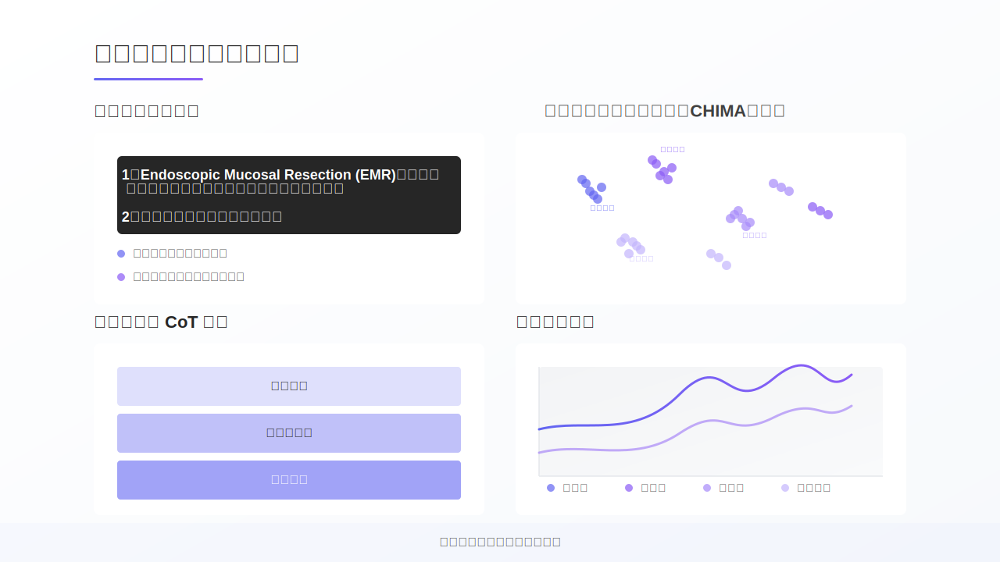

# Lecture Notes

## Slide-01-16-9

### Lecture Notes

## 讲义：基于DeepSeek的生成式AI开发实践

**主题：** 本次讲座主要介绍基于DeepSeek的生成式AI应用开发实践，重点是从API集成到长文本生成的过程。

**关键概念与关系：**

*   **DeepSeek:** 作为本次实践的核心AI模型，理解其API接口和功能是关键。
*   **API集成:** 讲解如何通过API调用DeepSeek模型，实现初步的生成式AI功能。
*   **长文本生成:** 深入探讨如何利用DeepSeek模型生成较长的、连贯的文本，可能涉及文本分块、上下文管理、以及控制生成质量等技术。
*   **生成式AI应用开发:** 最终目标是将DeepSeek模型集成到实际应用中，解决特定问题。

**结构与流程：**

1.  **引言：** 介绍讲座主题和DeepSeek模型。
2.  **API集成：** 详细讲解API的使用方法，包括认证、请求格式、以及响应处理。
3.  **长文本生成：** 讨论长文本生成的技术难点和解决方案，例如如何保持文本的连贯性。
4.  **应用实例：** 展示基于DeepSeek的生成式AI应用案例。
5.  **总结与展望：** 总结讲座内容，并展望生成式AI的未来发展。

**技术细节：**

*   API请求的参数设置（例如：temperature, top\_p等）。
*   文本编码与解码。
*   错误处理机制。
*   性能优化技巧。

**教育意义：**

*   帮助学生理解生成式AI的基本原理和应用。
*   培养学生使用AI模型解决实际问题的能力。
*   激发学生对人工智能领域的兴趣。

**演讲者信息：**

*   华磊，忻州师范学院计算机系
*   时间：14:50-15:20

## Slide-02-16-9

### Lecture Notes

## 讲义：讲者介绍

**主题：** 介绍讲者华磊的背景和研究方向。

**结构：** 采用分层结构，由总体到细节，清晰展示讲者的个人信息。

1.  **基本信息：**
    *   姓名：华磊
    *   职称：忻州师范学院计算机系 教师
    *   社会职务：北京卫生信息技术协会（PHITA）青委会副主委

2.  **教育背景：**
    *   美国密苏里大学
    *   医学信息学博士

3.  **工作经历：**
    *   北京协和医院信息中心工程师
    *   德州大学休斯顿医学科学中心博士研究员
    *   医渡科技高级数据总监

4.  **研究方向：**
    *   人机交互
    *   人工智能
    *   数据治理
    *   医院信息化
    *   互联网医疗
    *   可穿戴设备与大数据

5.  **2025 计划：**
    *   GitHub开源项目数量和贡献度
    *   会议和期刊文章发表情况

**教育意义：**

*   通过介绍讲者的多元背景，展示了交叉学科的优势。
*   强调了学术研究与行业实践相结合的重要性。
*   鼓励学生积极参与开源项目，提升实践能力。
*   通过可视化图表（publicationGradient），展示了科研成果的积累。

## Slide-03-16-9

### Lecture Notes

## MAUDE-to-Go 讲义

**主题:** MAUDE-to-Go：医疗设备数据处理与智能查询平台

**1. 研究背景与工作流程:**

*   **背景:** 针对FDA MAUDE数据库中4900万医疗设备报告进行数据分析。
*   **流程:**
    *   从FDA MAUDE数据库获取数据。
    *   进行数据处理，包括JSON/SQL自动化ETL（提取、转换、加载）。
    *   将数据存储在PostgreSQL数据库中，并结合混合搜索引擎。
    *   集成DeepSeek API，实现自然语言查询。

**2. 性能指标与优势:**

*   **快速部署:**
    *   硬件需求低：Mac Mini M4(~¥7000配置)。
    *   安装快速：30分钟安装，3分钟完成数据研究过程。
*   **数据规模:**
    *   支持160万/4900万规模的数据。
    *   支持全量数据和季度更新。
*   **可靠性:** 高一致性、低延迟、近实时。
*   **主要收益:**
    *   易用性提升(图表显示收益最高)。
    *   时间成本降低。
    *   设备需求降低。

**3. 教学要点:**

*   强调MAUDE-to-Go平台在医疗设备数据分析中的应用价值。
*   讲解ETL流程及其在数据处理中的作用。
*   对比传统数据分析方法，突出MAUDE-to-Go在部署速度、硬件需求和数据规模上的优势。
*   讨论自然语言查询在医疗数据分析中的应用前景。
*   分析图表中“主要收益”部分，引导学生理解不同维度收益的相对大小。

## Slide-04-16-9

### Lecture Notes

## 自然语言处理与智能数据分析讲义

**主题：** 自然语言处理(NLP)在数据分析中的应用

**核心概念：** 本讲义展示了如何利用NLP技术构建自然语言查询界面，并结合思维链(CoT)分析和可视化技术，实现智能数据分析。

**结构与流程：**

1.  **自然语言查询界面：** 允许用户使用自然语言提问，例如“Endoscopic Mucosal Resection (EMR)是什么，数据库相关的信息有哪些，可以做什么研究？请进行数据库数据质量分析。”。系统通过以下步骤理解查询：
    *   总体语义理解与意图提取
    *   自动识别关键词与上下文关联
2.  **语义聚类和相似度分析：** 对提取的语义信息进行聚类，分析相似度，并关联到：
    *   事件类型
    *   系统组件
    *   影响范围
    *   解决方案
3.  **基于思维链(CoT)分析：** 通过逐步分析，将复杂问题分解为：
    *   初始查询
    *   后续查询
    *   深度分析
4.  **可视化与效益：** 将分析结果可视化，并评估其效益，包括：
    *   及时性
    *   可重复性
    *   有效性
    *   去集中化

**教育意义：**

*   展示了NLP技术如何简化数据分析流程，降低用户门槛。
*   强调了思维链分析在解决复杂问题中的重要性。
*   突出了可视化在数据分析中的价值，帮助用户理解和利用数据。
*   强调了数据分析结果的实用性，包括及时性、可重复性和有效性。

## Slide-05-16-9

### Lecture Notes

## 讲义：MAUDE to GO: 研究影响与创新性

**主题：** 介绍AutoQUEST，一个基于LLM和Chain-of-Thought (CoT) 的医疗设备不良事件分析系统。

**1. 研究重要性：**

*   FDA MAUDE数据库包含大量医疗设备事件报告(4900万)。
*   AutoQUEST通过自然语言查询接口，降低了数据分析的门槛，使得临床医生无需专业数据科学背景即可使用。
*   能够快速识别医疗设备安全隐患和不良事件，为监管决策提供数据支持。
*   总体目标是提高医疗设备数据利用效率和安全监测水平。

**2. 创新亮点：**

*   **基于LLM的CoT问题生成：** 利用大型语言模型生成推理链，更好地理解用户查询意图。
*   **自动化问题验证与优化机制：** 自动验证和优化生成的问题，提高答案的准确性。
*   **交互式分析：** 减少用户认知负担，方便用户理解和分析结果。
*   **高效处理非结构化医疗文本数据：** 专门针对医疗文本数据的特点进行优化。
*   **端到端解决方案：** 提供从数据清洗到可视化的完整解决方案。

**3. AutoQUEST流程：**

*   **问题:** 用户提出的问题。
*   **CoT:** 系统生成Chain-of-Thought推理链。
*   **验证:** 验证推理链的合理性。
*   **优化:** 优化推理链，提升准确性。
*   **答案:** 基于推理链生成的答案。
*   **反馈:** 用户对答案的反馈。
*   **整合:** 将反馈整合到系统中，提升系统性能。
*   **结果:**最终输出结果。

**4. MedInfo 2025会议：**

*   该研究成果已被MedInfo 2025接收为Full Paper，将在台北举行的第20届世界医疗与健康信息学大会上展示。

**5. 教育意义：**

*   展示了LLM和CoT方法在医疗健康领域的应用潜力。
*   强调了数据驱动的医疗决策的重要性。
*   突出了人机协作在复杂问题解决中的作用。

## Slide-06-16-9

### Lecture Notes

## 长文本生成流程讲义

**主题：** 长文本生成（与可视化）

**核心概念：** 本讲义描述了一个使用DeepSeek API生成长文本的流程，并展示了其主要步骤。

**流程结构：**

1.  **用户输入与初始化：**
    *   **用户输入参数：** 标题、字数、体裁/语言等决定文本生成的基础。
    *   **环境设置：** 环境变量、日志记录、输出目录的配置保证程序运行的稳定性和可维护性。
    *   **DeepSeek API 访问：** 验证密钥、模型配置、重试机制确保能成功调用API。

2.  **大纲生成与优化：**
    *   **大纲生成：** 创建文章的骨架，包括节点结构、章节划分，并以JSON格式存储。
    *   **大纲验证与优化：** 检查大纲结构，优化章节内容，合并或拆分章节以提升逻辑性。
    *   **标题净化：** 清理标题，重新生成或过滤不合适的内容，保证标题质量。

3.  **文章生成与保存：**
    *   **文章组装：** 将引言、正文、结论按照大纲组合成完整的文章。
    *   **DeepSeek API 集成：** 调用DeepSeek API生成具体内容，处理错误，并设置重试机制。
    *   **输出管理：** 保存生成的文件，记录日志，返回结果。

**技术细节：**

*   **DeepSeek API：** 利用AI模型生成文本。
*   **JSON格式：** 用于存储和传递大纲数据。
*   **重试机制：** 增强系统在网络不稳定情况下的鲁棒性。
*   **日志记录：** 方便调试和追踪问题。

**教学要点：**

*   强调流程的模块化设计，每个阶段负责不同的任务。
*   讲解API调用中的错误处理和重试机制的重要性。
*   讨论大纲优化和标题净化的作用，提升文本质量。
*   结合实际案例，演示如何配置参数、生成大纲、以及调用API。

## Slide-07-16-9

### Lecture Notes

## AI编程助手功能对比讲义

**主题：** AI编程助手的功能对比与选择

**核心概念：** 本讲义旨在对比不同AI编程助手（GitHub Copilot, Cursor, Roo Code, Trae）在功能、集成方式、使用成本和隐私安全等方面的差异，帮助学习者根据自身需求选择合适的工具。

**主要内容：**

1.  **功能/工具对比：**
    *   **集成方式：** 区分VSCode插件、独立编辑器、命令行+VSCode等不同的集成方式。
    *   **具体功能：** 比较TAB键代码补全、代码解释、整个项目生成、长文件处理、项目理解与索引等功能的支持情况。
2.  **使用成本：** 对比付费/学生免费、需付费、API消耗大、免费等不同的收费模式。
3.  **隐私安全：** 简要对比各工具在隐私安全方面的表现。
4.  **图例说明：**
    *   ✓：优秀/支持
    *   ~：中等
    *   ✗：不佳/不支持
    *   $: 付费功能

**教育意义：**

*   了解不同AI编程助手的特点和适用场景。
*   掌握选择AI编程助手时需要考虑的关键因素。
*   培养批判性思维，根据实际需求做出明智的选择。

**注意：** 此比较基于2024年4月的功能情况，具体功能可能随版本更新而变化。

## Slide-08-16-9

### Lecture Notes

## AI编程助手最佳实践与技巧 讲义

**主题:** 如何有效地利用AI编程助手来提升开发效率和代码质量。

**核心概念:** 本讲义主要围绕四个关键领域，探讨AI编程助手的最佳实践：

1.  **指令优化:** 如何编写清晰、精确的指令，以便AI能够理解并执行任务。强调提供上下文、分解任务的重要性，以及避免模糊描述。
2.  **工作流优化:** 如何将AI融入到开发流程中，例如利用AI创建项目架构、分模块开发、代码审查和版本控制。
3.  **代码质量提升:** 如何利用AI来改善代码质量，包括添加注释、处理错误、生成单元测试和进行代码重构。
4.  **问题解决策略:** 如何利用AI来解决编程问题，包括提供详细错误信息、分步骤解决问题、比较多种解决方案和结合日志信息。

**层级结构:**

*   **标题:** AI编程助手最佳实践与技巧
*   **一级标题:** 指令优化, 工作流优化, 代码质量提升, 问题解决策略
*   **二级标题:** 每个一级标题下列出的具体实践技巧（使用✓/✗符号区分推荐和不推荐的做法）。

**技术细节:**

*   讲义中列出了使用AI编程助手时应遵循的具体步骤和技巧。
*   强调了明确指令、分解任务、版本控制、代码审查、单元测试等关键概念。

**教学要点:**

*   强调AI编程助手是辅助工具，而非替代开发者。
*   强调清晰的指令和良好的编程习惯对于AI的有效利用至关重要。
*   鼓励学生在实践中探索AI编程助手的各种功能，并根据项目需求选择合适的工具。
*   提醒学生注意AI可能存在的局限性，并进行必要的验证和调整。

## Slide-09-16-9

### Lecture Notes

## Roo Code + VSCode 人机协作编程演示 讲义

**主题:** 本讲义演示了如何使用 Roo Code 结合 VSCode 进行人机协作编程，以开发一个名为 “Long Writer” 的程序为例。

**核心概念与流程:**

*   **整体流程:** 从项目规划到最终演示，共分为五个阶段，形成一个线性流程。
*   **阶段 1: 项目规划 (架构师模式):** 使用 Roo Code 的架构师模式，定义项目结构、模块和依赖关系，为 "Long Writer" 程序奠定基础。
*   **阶段 2: 代码生成:** 利用 Roo Code 的代码模式自动生成目录结构、基础文件和配置环境，提高开发效率。
*   **阶段 3: 功能实现与集成:** 开发者编写核心功能模块，包括用户输入处理、API 调用、大纲生成和文本组装。这是人机协作的核心部分，需要开发者深入参与。
*   **阶段 4: 测试与文档生成:** 编写单元测试保证代码质量，并自动生成说明文档和使用手册，提升软件的可维护性和易用性。
*   **阶段 5: 演示与结果展示:** 运行程序生成演示文章，展示生成过程和结果，并分析性能指标，验证开发成果。

**教育意义:**

*   展示了人机协作在软件开发中的应用，强调了自动化工具在提高效率和质量方面的作用。
*   通过 "Long Writer" 程序的实例，讲解了软件开发的完整流程，使学生对软件工程有更直观的理解。
*   强调了测试和文档的重要性，培养学生良好的编程习惯。

## Slide-10-16-9

### Lecture Notes

## 讲义：LongWriter程序开发过程演示

**主题：** LongWriter程序的开发过程阶段展示与演示视频链接。

**概念关系：**

*   该图展示了LongWriter程序开发的四个主要阶段。
*   每个阶段都对应一个演示视频，视频通过缩略图和链接呈现。
*   阶段顺序：程序规划 -> 程序目录及文件生成 -> 代码编写及执行测试 -> 文档和PPT生成。

**结构/流程：**

1.  **标题：** 演示视频
2.  **阶段1：** LongWriter 程序规划 (对应视频链接)
3.  **阶段2：** 程序目录及文件生成 (对应视频链接)
4.  **阶段3：** 代码编写及执行测试 (对应视频链接)
5.  **阶段4：** 文档和PPT生成 (对应视频链接)
6.  **操作提示：** 点击视频缩略图播放相应的演示视频

**技术细节：**

*   使用了SVG的`<a href>`标签实现视频链接，`target="_blank"`在新标签页打开。
*   通过矩形、圆形和多边形组合创建视频缩略图的视觉效果。
*   线性渐变（linearGradient）用于填充背景和视频播放按钮，增加视觉层次感。
*   文本元素使用不同的字体大小、颜色和粗细来区分标题、阶段名称和提示信息。

**教学要点：**

*   强调软件开发过程的阶段性，每个阶段都有明确的任务和目标。
*   演示视频作为辅助学习工具，可以帮助学生更直观地理解每个阶段的具体内容。
*   可以引导学生思考每个阶段的重要性以及它们之间的依赖关系。
*   鼓励学生点击链接观看视频，并思考如何在自己的项目中应用这些开发流程。

## Slide-11-16-9

### Lecture Notes

## AI大模型分类 (2025) 讲义

**主题:** 2025年AI大模型的分类，包括国际模型和中国模型，以及开源与闭源的划分。

**概念关系:**

*   **AI大模型:** 总体概念，作为顶层节点。
*   **国际模型 vs. 中国模型:**  一级分类，基于地域划分。
*   **开源 vs. 闭源:** 二级分类，分别应用于国际模型和中国模型。
*   **具体模型:** 列举了2025年一些知名的AI大模型，并按照国际/中国进行区分。
*   **模型能力:**  对不同类型的大模型，列举了它们擅长的领域，例如文本、图像、音乐、视频等。

**结构:**

1.  **总览:** AI大模型 (2025)
2.  **一级分类:**
    *   国际模型 (开源/闭源)
    *   中国模型 (开源/闭源)
3.  **二级分类 (开源/闭源):**
    *   模型能力 (例如：文本、图像、音乐等)
4.  **示例:** 列举知名模型及其类型 (国际/中国)

**技术细节:**

*   **数据时间:** 数据截至2025年4月7日，表明信息具有时效性。
*   **模型类型:** 区分了文本、图像、音乐、视频等不同类型的模型，以及综合能力模型。
*   **开源/闭源:** 强调了模型发布方式的不同。

**教学要点:**

*   强调AI大模型分类的重要性，帮助学生理解不同模型的特点和应用场景。
*   通过地域和开源/闭源两个维度，清晰地展示了模型的分类体系。
*   结合具体模型案例，加深学生对不同类型模型的理解。
*   提醒学生关注数据的时效性，AI技术发展迅速，模型信息会不断更新。
*   可以引导学生思考开源和闭源模式对AI发展的影响。

## Slide-12-16-9

### Lecture Notes

## 讲义：AI辅助开发总结与未来展望

**主题:** 本次讲义总结了AI辅助开发的关键要点，并展望了未来的发展趋势。

**关键要点:**

*   **长文本生成能力:** DeepSeek等模型提供强大的长文本生成能力，适用于学术和商业应用。
*   **工程化API:** 工程化的API调用流程确保了AI服务的稳定性和可扩展性。
*   **大纲先行:** 采用大纲先行策略能够显著提升长文本的结构性和连贯性。
*   **高效开发体验:** Roo Code + VSCode组合提供了高效的AI辅助开发体验。
*   **指令优化:** 明确的指令优化和工作流程能够提升AI编程的质量。
*   **模型选择:** 国内外大模型各有优势，应根据具体需求进行选择。
*   **模型测试:** OpenRouter可用于非敏感内容的多模型性能对比测试。

**未来展望:**

*   **模型性能提升:** 模型性能将持续提升，特别是在长文本连贯性和专业领域知识方面。
*   **工具深度集成:** AI辅助编程工具将更深入地集成到开发流程中，从而提升代码质量和开发效率。

**趋势图:**

图表展示了AI模型在生成能力和开发工具方面的发展趋势。生成能力（蓝色）和开发工具（紫色）都呈现上升趋势，表明未来AI在这些方面的应用将更加广泛。

**教育意义:**

*   强调了AI在长文本生成和编程领域的应用潜力。
*   突出了工程化和流程优化的重要性，以确保AI应用的质量和效率。
*   鼓励根据实际需求选择合适的AI模型和工具。
*   展望了AI辅助开发工具的未来发展方向，激发学生对该领域的兴趣。

