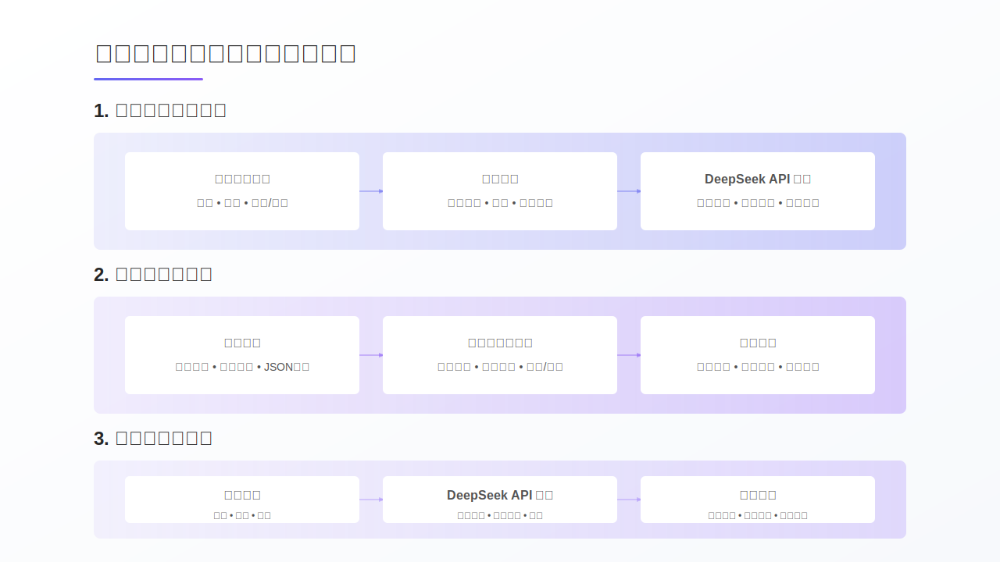

# Lecture Notes

## Slide-01-16-9

### Lecture Notes

好的，这是根据您提供的SVG信息生成的中文讲义草稿：

<<<<<<< Updated upstream
<<<<<<< Updated upstream
**主题：** 本次讲座主要介绍基于DeepSeek的生成式AI应用开发实践，重点是从API集成到长文本生成的过程。

**关键概念与关系：**

*   **DeepSeek:** 作为本次实践的核心AI模型，理解其API接口和功能是关键。
*   **API集成:** 讲解如何通过API调用DeepSeek模型，实现初步的生成式AI功能。
*   **长文本生成:** 深入探讨如何利用DeepSeek模型生成较长的、连贯的文本，可能涉及文本分块、上下文管理、以及控制生成质量等技术。
*   **生成式AI应用开发:** 最终目标是将DeepSeek模型集成到实际应用中，解决特定问题。

**结构与流程：**

1.  **引言：** 介绍讲座主题和DeepSeek模型。
2.  **API集成：** 详细讲解API的使用方法，包括认证、请求格式、以及响应处理。
3.  **长文本生成：** 讨论长文本生成的技术难点和解决方案，例如如何保持文本的连贯性。
4.  **应用实例：** 展示基于DeepSeek的生成式AI应用案例。
5.  **总结与展望：** 总结讲座内容，并展望生成式AI的未来发展。

**技术细节：**

*   API请求的参数设置（例如：temperature, top\_p等）。
*   文本编码与解码。
*   错误处理机制。
*   性能优化技巧。

**教育意义：**

*   帮助学生理解生成式AI的基本原理和应用。
*   培养学生使用AI模型解决实际问题的能力。
*   激发学生对人工智能领域的兴趣。

**演讲者信息：**

*   华磊，忻州师范学院计算机系
*   时间：14:50-15:20
=======
**讲义主题：基于DeepSeek的生成式AI开发实践**

**1. 核心主题与内容范围**

*   本次讲座的核心主题是“基于DeepSeek的生成式AI开发实践”。
*   我们将深入探讨如何利用DeepSeek这一特定的AI模型进行实际的生成式应用开发。
*   内容涵盖从基础的API集成方法，逐步进阶到处理更复杂的长文本生成任务。这表明讲座将从调用模型的基础操作讲起，逐步深入到应用模型解决实际问题的技术细节。

**2. 结构与流程**

*   讲座内容按照实践开发的流程展开：首先是**API集成**，这是与AI模型交互的基础；然后是**长文本生成**，这是利用模型能力解决特定复杂问题的应用。
*   整体结构遵循实践导向，旨在让学习者掌握具体的操作技能。

**3. 技术细节与教育洞察**

*   **技术细节：** 重点在于“API集成”和“长文本生成”。API集成是当前主流的AI模型调用方式，是进行AI应用开发的基础。长文本生成是生成式AI的一个重要应用方向，涉及如何引导模型生成连贯、有逻辑的长篇内容，具有较高的实践价值。
*   **教育洞察：** 本讲座强调“实践”，旨在弥合理论与实际应用之间的差距。通过基于特定模型（DeepSeek）的案例，帮助学习者理解生成式AI的工作原理，并掌握将其集成到自己的应用中以及处理特定生成任务（如长文本）的关键技术。

**4. 讲座信息**

*   **主讲人：** 华磊 (忻州师范学院 计算机系)
*   **时间：** 20:00-21:00
*   **背景：** 本讲座属于“生成式AI应用开发”系列内容的一部分。
>>>>>>> Stashed changes

=======
**讲义主题：基于DeepSeek的生成式AI开发实践**

**1. 核心主题与内容范围**

*   本次讲座的核心主题是“基于DeepSeek的生成式AI开发实践”。
*   我们将深入探讨如何利用DeepSeek这一特定的AI模型进行实际的生成式应用开发。
*   内容涵盖从基础的API集成方法，逐步进阶到处理更复杂的长文本生成任务。这表明讲座将从调用模型的基础操作讲起，逐步深入到应用模型解决实际问题的技术细节。

**2. 结构与流程**

*   讲座内容按照实践开发的流程展开：首先是**API集成**，这是与AI模型交互的基础；然后是**长文本生成**，这是利用模型能力解决特定复杂问题的应用。
*   整体结构遵循实践导向，旨在让学习者掌握具体的操作技能。

**3. 技术细节与教育洞察**

*   **技术细节：** 重点在于“API集成”和“长文本生成”。API集成是当前主流的AI模型调用方式，是进行AI应用开发的基础。长文本生成是生成式AI的一个重要应用方向，涉及如何引导模型生成连贯、有逻辑的长篇内容，具有较高的实践价值。
*   **教育洞察：** 本讲座强调“实践”，旨在弥合理论与实际应用之间的差距。通过基于特定模型（DeepSeek）的案例，帮助学习者理解生成式AI的工作原理，并掌握将其集成到自己的应用中以及处理特定生成任务（如长文本）的关键技术。

**4. 讲座信息**

*   **主讲人：** 华磊 (忻州师范学院 计算机系)
*   **时间：** 20:00-21:00
*   **背景：** 本讲座属于“生成式AI应用开发”系列内容的一部分。

>>>>>>> Stashed changes
这份讲义简明扼要地概括了讲座的核心内容、结构和学习重点，适合作为开场或回顾的参考。

## Slide-02-16-9

### Lecture Notes

<<<<<<< Updated upstream
<<<<<<< Updated upstream
## 讲义：讲者介绍

**主题：** 介绍讲者华磊的背景和研究方向。

**结构：** 采用分层结构，由总体到细节，清晰展示讲者的个人信息。

1.  **基本信息：**
    *   姓名：华磊
    *   职称：忻州师范学院计算机系 教师
    *   社会职务：北京卫生信息技术协会（PHITA）青委会副主委

2.  **教育背景：**
    *   美国密苏里大学
    *   医学信息学博士

3.  **工作经历：**
    *   北京协和医院信息中心工程师
    *   德州大学休斯顿医学科学中心博士研究员
    *   医渡科技高级数据总监

4.  **研究方向：**
    *   人机交互
    *   人工智能
    *   数据治理
    *   医院信息化
    *   互联网医疗
    *   可穿戴设备与大数据

5.  **2025 计划：**
    *   GitHub开源项目数量和贡献度
    *   会议和期刊文章发表情况

**教育意义：**

*   通过介绍讲者的多元背景，展示了交叉学科的优势。
*   强调了学术研究与行业实践相结合的重要性。
*   鼓励学生积极参与开源项目，提升实践能力。
*   通过可视化图表（publicationGradient），展示了科研成果的积累。
=======
好的，以下是基于您提供的SVG图和文本内容生成的讲座讲义：

**讲义：讲者介绍 (Speaker Introduction)**
>>>>>>> Stashed changes
=======
好的，以下是基于您提供的SVG图和文本内容生成的讲座讲义：

**讲义：讲者介绍 (Speaker Introduction)**
>>>>>>> Stashed changes

*   **主旨:** 本页幻灯片旨在向听众介绍本次讲座的讲者——华磊博士，建立其在相关领域的专业性和可信度。
*   **核心信息与结构:** 幻灯片采用清晰的分块结构，逻辑上从讲者身份到背景，再到专业领域和未来规划，层层递进。
    *   **讲者身份:** 直接呈现讲者姓名（华磊）及当前职务（忻州师范学院计算机系教师，北京卫生信息技术协会青委会副主委），确立其学术和行业身份。
    *   **教育背景:** 突出其学术根基，特别是跨学科的“医学信息学博士”学位（美国密苏里大学），这是其专业领域的基础。
    *   **工作经历:** 展示其职业发展轨迹，涵盖临床（北京协和医院）、学术研究（德州大学）和产业界（医渡科技），体现了丰富的实践经验和多视角的理解。
    *   **研究方向:** 列举了多个前沿且相关的技术领域（人机交互、人工智能、数据治理、患者安全、可穿戴设备、嵌入式系统），表明其专业兴趣广泛且与当前技术发展紧密结合，尤其是在医疗健康信息技术领域。
    *   **2025 计划:** 提供了具体的未来目标，包括开源贡献和学术产出计划，展现了讲者的积极性和持续发展意愿。图表元素可能用于形象化展示计划的进展或构成。
*   **教育洞察:** 通过介绍讲者的多元化背景（计算机+医学、学术+临床+产业），可以向听众传递跨学科学习和实践的重要性。其研究方向列表也为听众提供了该领域潜在的子方向参考。明确的未来计划则体现了目标设定和持续投入的价值。

## Slide-03-16-9

### Lecture Notes

<<<<<<< Updated upstream
<<<<<<< Updated upstream
## MAUDE-to-Go 讲义

**主题:** MAUDE-to-Go：医疗设备数据处理与智能查询平台

**1. 研究背景与工作流程:**

*   **背景:** 针对FDA MAUDE数据库中4900万医疗设备报告进行数据分析。
*   **流程:**
    *   从FDA MAUDE数据库获取数据。
    *   进行数据处理，包括JSON/SQL自动化ETL（提取、转换、加载）。
    *   将数据存储在PostgreSQL数据库中，并结合混合搜索引擎。
    *   集成DeepSeek API，实现自然语言查询。

**2. 性能指标与优势:**

*   **快速部署:**
    *   硬件需求低：Mac Mini M4(~¥7000配置)。
    *   安装快速：30分钟安装，3分钟完成数据研究过程。
*   **数据规模:**
    *   支持160万/4900万规模的数据。
    *   支持全量数据和季度更新。
*   **可靠性:** 高一致性、低延迟、近实时。
*   **主要收益:**
    *   易用性提升(图表显示收益最高)。
    *   时间成本降低。
    *   设备需求降低。

**3. 教学要点:**

*   强调MAUDE-to-Go平台在医疗设备数据分析中的应用价值。
*   讲解ETL流程及其在数据处理中的作用。
*   对比传统数据分析方法，突出MAUDE-to-Go在部署速度、硬件需求和数据规模上的优势。
*   讨论自然语言查询在医疗数据分析中的应用前景。
*   分析图表中“主要收益”部分，引导学生理解不同维度收益的相对大小。
=======
好的，以下是基于提供的SVG图示生成的MAUDE-to-Go项目讲义：

**讲义主题：MAUDE-to-Go：医疗设备数据处理与智能查询平台**

**1. 研究背景与项目概述**
*   **核心问题：** 如何高效处理和查询FDA MAUDE数据库中海量的医疗设备不良事件报告数据（约4900万份）。
*   **项目目标：** 构建一个易于部署、高性能的平台，实现对MAUDE数据的智能处理与自然语言查询。

**2. MAUDE-to-Go 工作流程**
*   **数据来源：** FDA MAUDE数据库 (包含约4900万份原始报告)。
*   **数据处理：** 采用JSON/SQL自动化ETL（抽取、转换、加载）流程，清洗和结构化原始数据。
*   **数据存储：** 将处理后的数据存储在PostgreSQL数据库和混合搜索引擎中，以便于结构化查询和全文检索。
*   **智能查询：** 集成DeepSeek API，支持用户通过自然语言进行查询，降低技术门槛。

**3. 性能指标与优势**
*   **快速部署：**
    *   硬件要求低：可在普通配置电脑上运行（如Mac Mini M4，约¥7000）。
    *   部署迅速：安装约30分钟，完成数据研究过程约3分钟。
*   **数据规模：**
    *   支持处理大规模数据（例如，已处理160万/总计4900万报告）。
    *   支持自定义规模的数据更新和处理。
*   **可靠性：**
    *   数据处理与查询结果具备高一致性。
    *   系统响应延迟低，接近实时查询。

=======
好的，以下是基于提供的SVG图示生成的MAUDE-to-Go项目讲义：

**讲义主题：MAUDE-to-Go：医疗设备数据处理与智能查询平台**

**1. 研究背景与项目概述**
*   **核心问题：** 如何高效处理和查询FDA MAUDE数据库中海量的医疗设备不良事件报告数据（约4900万份）。
*   **项目目标：** 构建一个易于部署、高性能的平台，实现对MAUDE数据的智能处理与自然语言查询。

**2. MAUDE-to-Go 工作流程**
*   **数据来源：** FDA MAUDE数据库 (包含约4900万份原始报告)。
*   **数据处理：** 采用JSON/SQL自动化ETL（抽取、转换、加载）流程，清洗和结构化原始数据。
*   **数据存储：** 将处理后的数据存储在PostgreSQL数据库和混合搜索引擎中，以便于结构化查询和全文检索。
*   **智能查询：** 集成DeepSeek API，支持用户通过自然语言进行查询，降低技术门槛。

**3. 性能指标与优势**
*   **快速部署：**
    *   硬件要求低：可在普通配置电脑上运行（如Mac Mini M4，约¥7000）。
    *   部署迅速：安装约30分钟，完成数据研究过程约3分钟。
*   **数据规模：**
    *   支持处理大规模数据（例如，已处理160万/总计4900万报告）。
    *   支持自定义规模的数据更新和处理。
*   **可靠性：**
    *   数据处理与查询结果具备高一致性。
    *   系统响应延迟低，接近实时查询。

>>>>>>> Stashed changes
**4. 主要收益**
*   通过直观图表展示了平台带来的相对收益：
    *   **易用性：** 显著提升（图示最高，约100%相对提升）。
    *   **时间成本：** 大幅降低（图示居中，约50%相对降低）。
    *   **设备需求：** 显著降低（图示最低，反映了低硬件成本优势）。
<<<<<<< Updated upstream
>>>>>>> Stashed changes
=======
>>>>>>> Stashed changes

**教育洞察：** MAUDE-to-Go项目是大数据处理、数据库技术（PostgreSQL）、搜索引擎技术和人工智能（自然语言处理）结合解决实际行业问题的范例。它强调了从原始数据到智能应用的全流程构建，并关注了实际部署的成本和效率。理解这个流程有助于学生认识到跨领域技术集成的价值。

## Slide-04-16-9

### Lecture Notes

好的，以下是基于您提供的SVG图和文本内容生成的中文讲义：

<<<<<<< Updated upstream
<<<<<<< Updated upstream
**主题：** 自然语言处理(NLP)在数据分析中的应用

**核心概念：** 本讲义展示了如何利用NLP技术构建自然语言查询界面，并结合思维链(CoT)分析和可视化技术，实现智能数据分析。

**结构与流程：**

1.  **自然语言查询界面：** 允许用户使用自然语言提问，例如“Endoscopic Mucosal Resection (EMR)是什么，数据库相关的信息有哪些，可以做什么研究？请进行数据库数据质量分析。”。系统通过以下步骤理解查询：
    *   总体语义理解与意图提取
    *   自动识别关键词与上下文关联
2.  **语义聚类和相似度分析：** 对提取的语义信息进行聚类，分析相似度，并关联到：
    *   事件类型
    *   系统组件
    *   影响范围
    *   解决方案
3.  **基于思维链(CoT)分析：** 通过逐步分析，将复杂问题分解为：
    *   初始查询
    *   后续查询
    *   深度分析
4.  **可视化与效益：** 将分析结果可视化，并评估其效益，包括：
    *   及时性
    *   可重复性
    *   有效性
    *   去集中化

**教育意义：**

*   展示了NLP技术如何简化数据分析流程，降低用户门槛。
*   强调了思维链分析在解决复杂问题中的重要性。
*   突出了可视化在数据分析中的价值，帮助用户理解和利用数据。
*   强调了数据分析结果的实用性，包括及时性、可重复性和有效性。
=======
**讲义主题：自然语言处理与智能数据分析能力**

**核心概念:** 本讲义将探讨如何构建一个系统，使用户能够通过日常的自然语言与数据进行交互和分析，而非依赖复杂的查询语言或工具。

**系统流程与关键组件:**

1.  **自然语言查询界面:**
    *   系统入口：用户直接输入自然语言问题，例如关于特定医学概念（EMR）的数据库信息查询及研究方向，或数据质量分析请求。
    *   特点：支持复杂、多部分的自然语言表达。

2.  **自然语言处理与理解 (NLP):**
    *   **总体语义理解与意图提取:** 系统首先解析句子的整体含义，识别用户的核心目的（如查询、分析）。
    *   **自动识别关键词与上下文关联:** 提取关键术语（如 EMR、数据库、数据质量）并理解它们在句子中的相互关系。

3.  **智能分析引擎:**
    *   **语义聚类和相似度分析:** 对数据或相关概念进行分组（如事件类型、系统组件、影响范围、解决方案），发现数据间的相似性和内在联系。
    *   **基于思维链 (CoT) 分析:** 对于复杂或需要多步推理的问题，系统会模拟人类思考过程，分解为：
        *   **初始查询:** 理解问题的起点。
        *   **规划和迭代:** 制定分析步骤并根据中间结果调整。
        *   **深度分析:** 执行详细的数据处理和推理以得出结论。

4.  **可视化与效益:**
    *   **可视化呈现:** 将复杂的分析结果以图表等直观方式展示给用户。
    *   **系统效益:** 带来**及时性**（快速获取信息）、**可重复**（分析过程可复现）和**有效性**（提供有价值的洞察）。
>>>>>>> Stashed changes
=======
**讲义主题：自然语言处理与智能数据分析能力**

**核心概念:** 本讲义将探讨如何构建一个系统，使用户能够通过日常的自然语言与数据进行交互和分析，而非依赖复杂的查询语言或工具。

**系统流程与关键组件:**

1.  **自然语言查询界面:**
    *   系统入口：用户直接输入自然语言问题，例如关于特定医学概念（EMR）的数据库信息查询及研究方向，或数据质量分析请求。
    *   特点：支持复杂、多部分的自然语言表达。

2.  **自然语言处理与理解 (NLP):**
    *   **总体语义理解与意图提取:** 系统首先解析句子的整体含义，识别用户的核心目的（如查询、分析）。
    *   **自动识别关键词与上下文关联:** 提取关键术语（如 EMR、数据库、数据质量）并理解它们在句子中的相互关系。

3.  **智能分析引擎:**
    *   **语义聚类和相似度分析:** 对数据或相关概念进行分组（如事件类型、系统组件、影响范围、解决方案），发现数据间的相似性和内在联系。
    *   **基于思维链 (CoT) 分析:** 对于复杂或需要多步推理的问题，系统会模拟人类思考过程，分解为：
        *   **初始查询:** 理解问题的起点。
        *   **规划和迭代:** 制定分析步骤并根据中间结果调整。
        *   **深度分析:** 执行详细的数据处理和推理以得出结论。

4.  **可视化与效益:**
    *   **可视化呈现:** 将复杂的分析结果以图表等直观方式展示给用户。
    *   **系统效益:** 带来**及时性**（快速获取信息）、**可重复**（分析过程可复现）和**有效性**（提供有价值的洞察）。
>>>>>>> Stashed changes

**教育洞察:** 这种能力是人机交互和数据智能化的重要发展方向，它降低了数据分析的门槛，使得非技术用户也能有效地利用数据解决问题。理解其背后的NLP、分析方法（如聚类、CoT）和系统架构对于构建下一代智能应用至关重要。

## Slide-05-16-9

### Lecture Notes

<<<<<<< Updated upstream
<<<<<<< Updated upstream
## 讲义：MAUDE to GO: 研究影响与创新性

**主题：** 介绍AutoQUEST，一个基于LLM和Chain-of-Thought (CoT) 的医疗设备不良事件分析系统。

**1. 研究重要性：**

*   FDA MAUDE数据库包含大量医疗设备事件报告(4900万)。
*   AutoQUEST通过自然语言查询接口，降低了数据分析的门槛，使得临床医生无需专业数据科学背景即可使用。
*   能够快速识别医疗设备安全隐患和不良事件，为监管决策提供数据支持。
*   总体目标是提高医疗设备数据利用效率和安全监测水平。

**2. 创新亮点：**

*   **基于LLM的CoT问题生成：** 利用大型语言模型生成推理链，更好地理解用户查询意图。
*   **自动化问题验证与优化机制：** 自动验证和优化生成的问题，提高答案的准确性。
*   **交互式分析：** 减少用户认知负担，方便用户理解和分析结果。
*   **高效处理非结构化医疗文本数据：** 专门针对医疗文本数据的特点进行优化。
*   **端到端解决方案：** 提供从数据清洗到可视化的完整解决方案。

**3. AutoQUEST流程：**

*   **问题:** 用户提出的问题。
*   **CoT:** 系统生成Chain-of-Thought推理链。
*   **验证:** 验证推理链的合理性。
*   **优化:** 优化推理链，提升准确性。
*   **答案:** 基于推理链生成的答案。
*   **反馈:** 用户对答案的反馈。
*   **整合:** 将反馈整合到系统中，提升系统性能。
*   **结果:**最终输出结果。

**4. MedInfo 2025会议：**

*   该研究成果已被MedInfo 2025接收为Full Paper，将在台北举行的第20届世界医疗与健康信息学大会上展示。

**5. 教育意义：**

*   展示了LLM和CoT方法在医疗健康领域的应用潜力。
*   强调了数据驱动的医疗决策的重要性。
*   突出了人机协作在复杂问题解决中的作用。
=======
好的，这是一份基于提供的SVG图示和文本内容生成的讲义草稿，旨在解释该研究项目。

---

**讲义主题：MAUDE to GO: 基于LLM的医疗设备事件数据分析**

**1. 项目概览与背景 (MedInfo 2025)**
*   本项目题为“MAUDE to GO: 研究影响与创新性”，具体方法是“AutoQUEST: 基于LLM的CoT方法”。
*   这是一篇将在2025年第20届世界医疗健康信息学大会（MedInfo 2025，台北）上发表的论文。
*   核心目标：解决FDA MAUDE数据库中海量（4900万条）医疗设备事件报告的分析难题。

**2. 研究重要性**
*   **数据价值巨大：** MAUDE数据库是识别医疗设备安全隐患和不良事件的关键来源。
*   **降低门槛：** 提供自然语言查询接口，使非数据科学背景的临床医生也能轻松访问和分析数据。
*   **提升效率：** 快速识别问题，为监管决策提供数据支持，提高数据利用效率和安全监测水平。

**3. 创新亮点 (AutoQUEST)**
*   **核心技术：** 基于大型语言模型 (LLM) 的 Chain-of-Thought (CoT) 方法。
    *   **CoT问题生成：** 利用LLM的推理能力生成分析问题。
    *   **自动化验证与优化：** 内置机制自动验证生成的问题和答案，并进行优化。
*   **用户体验：** 交互式分析设计，减少用户认知负担。
*   **数据处理：** 高效处理MAUDE中大量的非结构化医疗文本数据。
*   **端到端方案：** 提供从数据清洗到结果可视化的完整解决方案。

**4. AutoQUEST CoT流程 (图示)**
*   流程展示了如何通过迭代优化获得可靠结果：
    *   从用户“问题”开始。
    *   通过“CoT”链式思考生成初步分析。
    *   进行“验证”和“优化”步骤，改进过程和答案。
    *   得到初步“答案”。
    *   再次“验证”答案的准确性。
    *   根据“反馈”进行调整和“整合”。
    *   最终输出可靠的“结果”。

**总结：** AutoQUEST项目利用LLM和CoT技术，为MAUDE数据库提供了一个创新、易用的分析工具，显著提升了医疗设备安全数据的可访问性和应用价值。
>>>>>>> Stashed changes

=======
好的，这是一份基于提供的SVG图示和文本内容生成的讲义草稿，旨在解释该研究项目。

---

**讲义主题：MAUDE to GO: 基于LLM的医疗设备事件数据分析**

**1. 项目概览与背景 (MedInfo 2025)**
*   本项目题为“MAUDE to GO: 研究影响与创新性”，具体方法是“AutoQUEST: 基于LLM的CoT方法”。
*   这是一篇将在2025年第20届世界医疗健康信息学大会（MedInfo 2025，台北）上发表的论文。
*   核心目标：解决FDA MAUDE数据库中海量（4900万条）医疗设备事件报告的分析难题。

**2. 研究重要性**
*   **数据价值巨大：** MAUDE数据库是识别医疗设备安全隐患和不良事件的关键来源。
*   **降低门槛：** 提供自然语言查询接口，使非数据科学背景的临床医生也能轻松访问和分析数据。
*   **提升效率：** 快速识别问题，为监管决策提供数据支持，提高数据利用效率和安全监测水平。

**3. 创新亮点 (AutoQUEST)**
*   **核心技术：** 基于大型语言模型 (LLM) 的 Chain-of-Thought (CoT) 方法。
    *   **CoT问题生成：** 利用LLM的推理能力生成分析问题。
    *   **自动化验证与优化：** 内置机制自动验证生成的问题和答案，并进行优化。
*   **用户体验：** 交互式分析设计，减少用户认知负担。
*   **数据处理：** 高效处理MAUDE中大量的非结构化医疗文本数据。
*   **端到端方案：** 提供从数据清洗到结果可视化的完整解决方案。

**4. AutoQUEST CoT流程 (图示)**
*   流程展示了如何通过迭代优化获得可靠结果：
    *   从用户“问题”开始。
    *   通过“CoT”链式思考生成初步分析。
    *   进行“验证”和“优化”步骤，改进过程和答案。
    *   得到初步“答案”。
    *   再次“验证”答案的准确性。
    *   根据“反馈”进行调整和“整合”。
    *   最终输出可靠的“结果”。

**总结：** AutoQUEST项目利用LLM和CoT技术，为MAUDE数据库提供了一个创新、易用的分析工具，显著提升了医疗设备安全数据的可访问性和应用价值。

>>>>>>> Stashed changes
---

## Slide-06-16-9

### Lecture Notes

<<<<<<< Updated upstream
<<<<<<< Updated upstream
## 长文本生成流程讲义

**主题：** 长文本生成（与可视化）

**核心概念：** 本讲义描述了一个使用DeepSeek API生成长文本的流程，并展示了其主要步骤。

**流程结构：**

1.  **用户输入与初始化：**
    *   **用户输入参数：** 标题、字数、体裁/语言等决定文本生成的基础。
    *   **环境设置：** 环境变量、日志记录、输出目录的配置保证程序运行的稳定性和可维护性。
    *   **DeepSeek API 访问：** 验证密钥、模型配置、重试机制确保能成功调用API。

2.  **大纲生成与优化：**
    *   **大纲生成：** 创建文章的骨架，包括节点结构、章节划分，并以JSON格式存储。
    *   **大纲验证与优化：** 检查大纲结构，优化章节内容，合并或拆分章节以提升逻辑性。
    *   **标题净化：** 清理标题，重新生成或过滤不合适的内容，保证标题质量。

3.  **文章生成与保存：**
    *   **文章组装：** 将引言、正文、结论按照大纲组合成完整的文章。
    *   **DeepSeek API 集成：** 调用DeepSeek API生成具体内容，处理错误，并设置重试机制。
    *   **输出管理：** 保存生成的文件，记录日志，返回结果。

**技术细节：**

*   **DeepSeek API：** 利用AI模型生成文本。
*   **JSON格式：** 用于存储和传递大纲数据。
*   **重试机制：** 增强系统在网络不稳定情况下的鲁棒性。
*   **日志记录：** 方便调试和追踪问题。

**教学要点：**

*   强调流程的模块化设计，每个阶段负责不同的任务。
*   讲解API调用中的错误处理和重试机制的重要性。
*   讨论大纲优化和标题净化的作用，提升文本质量。
*   结合实际案例，演示如何配置参数、生成大纲、以及调用API。
=======
好的，这是一份基于您提供的SVG图和文本内容生成的中文讲义提纲：

**讲义主题：基于AI的长文本生成流程**

本讲将介绍一个利用大型语言模型（如DeepSeek API）进行长文本生成的系统流程，如图所示。整个过程可分为三个主要阶段：

1.  **用户输入与初始化**
    *   **目的：** 收集生成文本所需的用户指定参数，并进行系统环境的准备。
    *   **关键步骤：**
        *   **用户输入参数：** 接收用户对文本内容、格式等的要求，如标题、字数、体裁/语言。
        *   **环境设置：** 配置系统运行环境，包括环境变量、日志记录设置和最终输出文件的存放目录。
        *   **DeepSeek API 访问：** 建立与AI模型的连接，涉及验证API密钥、配置模型参数以及设置网络请求的重试机制，确保稳定调用。

2.  **大纲生成与优化**
    *   **目的：** 在生成全文之前，构建并完善文章的骨架结构。
    *   **关键步骤：**
        *   **大纲生成：** 利用AI模型根据用户输入生成初步的大纲，通常以节点结构或章节划分的形式呈现，可能采用JSON等结构化格式。
        *   **大纲验证与优化：** 对生成的大纲进行结构检查，优化章节逻辑，必要时进行章节的合并或拆分，以提高文章逻辑性。
        *   **标题净化：** 清理或调整大纲中的章节标题，使其更规范、准确，可能涉及重新生成或内容过滤。

3.  **文章生成与保存**
    *   **目的：** 根据优化后的大纲生成最终文本内容，并进行保存和管理。
    *   **关键步骤：**
        *   **文章组装：** 按照大纲结构，逐步生成并组合文章的各个部分，通常包括引言、正文各章节和结论。
        *   **DeepSeek API 集成：** 核心步骤，通过调用DeepSeek API生成每个章节或段落的具体内容，需要处理模型调用过程中的潜在错误并实现重试逻辑。
        *   **输出管理：** 将生成的完整文章保存到指定文件，记录生成过程的关键日志，并将最终结果返回给用户或后续系统。
>>>>>>> Stashed changes

=======
好的，这是一份基于您提供的SVG图和文本内容生成的中文讲义提纲：

**讲义主题：基于AI的长文本生成流程**

本讲将介绍一个利用大型语言模型（如DeepSeek API）进行长文本生成的系统流程，如图所示。整个过程可分为三个主要阶段：

1.  **用户输入与初始化**
    *   **目的：** 收集生成文本所需的用户指定参数，并进行系统环境的准备。
    *   **关键步骤：**
        *   **用户输入参数：** 接收用户对文本内容、格式等的要求，如标题、字数、体裁/语言。
        *   **环境设置：** 配置系统运行环境，包括环境变量、日志记录设置和最终输出文件的存放目录。
        *   **DeepSeek API 访问：** 建立与AI模型的连接，涉及验证API密钥、配置模型参数以及设置网络请求的重试机制，确保稳定调用。

2.  **大纲生成与优化**
    *   **目的：** 在生成全文之前，构建并完善文章的骨架结构。
    *   **关键步骤：**
        *   **大纲生成：** 利用AI模型根据用户输入生成初步的大纲，通常以节点结构或章节划分的形式呈现，可能采用JSON等结构化格式。
        *   **大纲验证与优化：** 对生成的大纲进行结构检查，优化章节逻辑，必要时进行章节的合并或拆分，以提高文章逻辑性。
        *   **标题净化：** 清理或调整大纲中的章节标题，使其更规范、准确，可能涉及重新生成或内容过滤。

3.  **文章生成与保存**
    *   **目的：** 根据优化后的大纲生成最终文本内容，并进行保存和管理。
    *   **关键步骤：**
        *   **文章组装：** 按照大纲结构，逐步生成并组合文章的各个部分，通常包括引言、正文各章节和结论。
        *   **DeepSeek API 集成：** 核心步骤，通过调用DeepSeek API生成每个章节或段落的具体内容，需要处理模型调用过程中的潜在错误并实现重试逻辑。
        *   **输出管理：** 将生成的完整文章保存到指定文件，记录生成过程的关键日志，并将最终结果返回给用户或后续系统。

>>>>>>> Stashed changes
**总结：** 整个流程是一个线性的、多阶段的过程，从用户需求出发，经过结构化（大纲）和内容生成，最终产出并管理长文本。图示清晰地展示了各阶段内部的并行和串行子任务，以及阶段间的依赖关系。

## Slide-07-16-9

### Lecture Notes

<<<<<<< Updated upstream
<<<<<<< Updated upstream
## AI编程助手功能对比讲义

**主题：** AI编程助手的功能对比与选择

**核心概念：** 本讲义旨在对比不同AI编程助手（GitHub Copilot, Cursor, Roo Code, Trae）在功能、集成方式、使用成本和隐私安全等方面的差异，帮助学习者根据自身需求选择合适的工具。

**主要内容：**

1.  **功能/工具对比：**
    *   **集成方式：** 区分VSCode插件、独立编辑器、命令行+VSCode等不同的集成方式。
    *   **具体功能：** 比较TAB键代码补全、代码解释、整个项目生成、长文件处理、项目理解与索引等功能的支持情况。
2.  **使用成本：** 对比付费/学生免费、需付费、API消耗大、免费等不同的收费模式。
3.  **隐私安全：** 简要对比各工具在隐私安全方面的表现。
4.  **图例说明：**
    *   ✓：优秀/支持
    *   ~：中等
    *   ✗：不佳/不支持
    *   $: 付费功能

**教育意义：**

*   了解不同AI编程助手的特点和适用场景。
*   掌握选择AI编程助手时需要考虑的关键因素。
*   培养批判性思维，根据实际需求做出明智的选择。

**注意：** 此比较基于2024年4月的功能情况，具体功能可能随版本更新而变化。
=======
好的，这是一份基于您提供的SVG图表和文本内容生成的中文讲义：

**讲义主题：AI编程助手功能对比与选择指南**

**1. 主要议题介绍**
*   本次讲座将对比分析当前主流的AI编程助手，帮助大家了解它们的核心功能和差异。
*   AI编程助手能显著提高开发效率，但不同工具各有侧重，选择合适的工具至关重要。

**2. 对比对象**
*   我们将重点考察以下四款AI编程助手：
    *   GitHub Copilot
    *   Cursor
    *   Roo Code
    *   Trae

**3. 关键功能对比与分析**
*   **集成方式：** 工具如何与开发环境结合？
    *   GitHub Copilot：常见的VSCode插件形式。
    *   Cursor：提供独立的编辑器。
    *   Roo Code：结合命令行和VSCode。
    *   Trae：提供独立的编辑器。
*   **TAB键代码补全：** 这是最基础且常用的功能。
    *   GitHub Copilot 和 Trae 表现优秀 (✓)。
    *   Cursor 此功能为付费 ($)。
    *   Roo Code 不支持此功能 (✗)。
*   **代码解释：** 理解现有代码的功能。
    *   GitHub Copilot, Roo Code, Trae 均支持且表现优秀 (✓)。
    *   Cursor 此功能为付费 ($)。
*   **整个项目生成：** 根据需求生成完整项目框架或模块。
    *   Roo Code 表现优秀 (✓)。
    *   GitHub Copilot 和 Trae 表现中等 (~)。
    *   Cursor 此功能为付费 ($)。
*   **长文件处理：** 处理大型代码文件时的能力。
    *   Trae 表现优秀 (✓)。
    *   GitHub Copilot 和 Roo Code 表现中等 (~)。
    *   Cursor 此功能为付费 ($)。
*   **项目理解与索引：** 助手对整个项目结构和代码关联性的理解能力。
    *   GitHub Copilot 和 Trae 表现优秀 (✓)。
    *   Roo Code 表现中等 (~)。
    *   Cursor 此功能为付费 ($)。

**4. 成本与隐私**
*   **使用成本：**
    *   GitHub Copilot：付费，但学生有免费计划。
    *   Cursor：需付费使用。
    *   Roo Code：主要消耗API调用成本。
    *   Trae：免费。
*   **隐私安全：** 需要关注代码数据的使用和存储方式。
    *   Cursor 和 Trae 在隐私方面表现不佳 (✗)。
    *   GitHub Copilot 和 Roo Code 表现中等 (~)。

=======
好的，这是一份基于您提供的SVG图表和文本内容生成的中文讲义：

**讲义主题：AI编程助手功能对比与选择指南**

**1. 主要议题介绍**
*   本次讲座将对比分析当前主流的AI编程助手，帮助大家了解它们的核心功能和差异。
*   AI编程助手能显著提高开发效率，但不同工具各有侧重，选择合适的工具至关重要。

**2. 对比对象**
*   我们将重点考察以下四款AI编程助手：
    *   GitHub Copilot
    *   Cursor
    *   Roo Code
    *   Trae

**3. 关键功能对比与分析**
*   **集成方式：** 工具如何与开发环境结合？
    *   GitHub Copilot：常见的VSCode插件形式。
    *   Cursor：提供独立的编辑器。
    *   Roo Code：结合命令行和VSCode。
    *   Trae：提供独立的编辑器。
*   **TAB键代码补全：** 这是最基础且常用的功能。
    *   GitHub Copilot 和 Trae 表现优秀 (✓)。
    *   Cursor 此功能为付费 ($)。
    *   Roo Code 不支持此功能 (✗)。
*   **代码解释：** 理解现有代码的功能。
    *   GitHub Copilot, Roo Code, Trae 均支持且表现优秀 (✓)。
    *   Cursor 此功能为付费 ($)。
*   **整个项目生成：** 根据需求生成完整项目框架或模块。
    *   Roo Code 表现优秀 (✓)。
    *   GitHub Copilot 和 Trae 表现中等 (~)。
    *   Cursor 此功能为付费 ($)。
*   **长文件处理：** 处理大型代码文件时的能力。
    *   Trae 表现优秀 (✓)。
    *   GitHub Copilot 和 Roo Code 表现中等 (~)。
    *   Cursor 此功能为付费 ($)。
*   **项目理解与索引：** 助手对整个项目结构和代码关联性的理解能力。
    *   GitHub Copilot 和 Trae 表现优秀 (✓)。
    *   Roo Code 表现中等 (~)。
    *   Cursor 此功能为付费 ($)。

**4. 成本与隐私**
*   **使用成本：**
    *   GitHub Copilot：付费，但学生有免费计划。
    *   Cursor：需付费使用。
    *   Roo Code：主要消耗API调用成本。
    *   Trae：免费。
*   **隐私安全：** 需要关注代码数据的使用和存储方式。
    *   Cursor 和 Trae 在隐私方面表现不佳 (✗)。
    *   GitHub Copilot 和 Roo Code 表现中等 (~)。

>>>>>>> Stashed changes
**5. 图例说明**
*   ✓：优秀/支持
*   ~：中等
*   ✗：不佳/不支持
*   $：付费功能
<<<<<<< Updated upstream
>>>>>>> Stashed changes
=======
>>>>>>> Stashed changes

**6. 总结**
*   选择AI编程助手时，应综合考虑您的核心需求（代码补全、项目生成、长文件处理等）、习惯的开发环境（插件还是独立编辑器）、预算以及对隐私安全的要求。
*   请注意，此比较基于2025年2月的功能情况，AI工具发展迅速，功能可能会有更新。

## Slide-08-16-9

### Lecture Notes

<<<<<<< Updated upstream
<<<<<<< Updated upstream
## AI编程助手最佳实践与技巧 讲义

**主题:** 如何有效地利用AI编程助手来提升开发效率和代码质量。

**核心概念:** 本讲义主要围绕四个关键领域，探讨AI编程助手的最佳实践：

1.  **指令优化:** 如何编写清晰、精确的指令，以便AI能够理解并执行任务。强调提供上下文、分解任务的重要性，以及避免模糊描述。
2.  **工作流优化:** 如何将AI融入到开发流程中，例如利用AI创建项目架构、分模块开发、代码审查和版本控制。
3.  **代码质量提升:** 如何利用AI来改善代码质量，包括添加注释、处理错误、生成单元测试和进行代码重构。
4.  **问题解决策略:** 如何利用AI来解决编程问题，包括提供详细错误信息、分步骤解决问题、比较多种解决方案和结合日志信息。

**层级结构:**

*   **标题:** AI编程助手最佳实践与技巧
*   **一级标题:** 指令优化, 工作流优化, 代码质量提升, 问题解决策略
*   **二级标题:** 每个一级标题下列出的具体实践技巧（使用✓/✗符号区分推荐和不推荐的做法）。

**技术细节:**

*   讲义中列出了使用AI编程助手时应遵循的具体步骤和技巧。
*   强调了明确指令、分解任务、版本控制、代码审查、单元测试等关键概念。

**教学要点:**

*   强调AI编程助手是辅助工具，而非替代开发者。
*   强调清晰的指令和良好的编程习惯对于AI的有效利用至关重要。
*   鼓励学生在实践中探索AI编程助手的各种功能，并根据项目需求选择合适的工具。
*   提醒学生注意AI可能存在的局限性，并进行必要的验证和调整。
=======
好的，这是一份基于您提供的SVG图示和文本内容生成的中文讲义：

**主题：AI编程助手最佳实践与技巧**

本讲义将围绕如何高效、高质量地利用AI编程助手展开，涵盖指令、工作流、代码质量和问题解决等关键方面。

1.  **核心理念：** 将AI视为强大的协作者，通过掌握恰当的沟通和协作方法，最大化其价值。

2.  **四大实践领域：**
    *   **指令优化：** 提升AI理解和执行任务的准确性。
        *   ✓ 使用明确、精确的指令，避免歧义。
        *   ✓ 提供充分的上下文和具体需求，帮助AI理解全貌。
        *   ✓ 将复杂任务分解为更小的、可管理的步骤。
        *   ✗ 避免使用模糊或过于抽象的描述，这会导致AI产出不符合预期的结果。
    *   **工作流优化：** 将AI无缝集成到开发流程中。
        *   ✓ 利用AI快速创建项目基础架构，加速启动。
        *   ✓ 采用分模块开发策略，逐步实现功能，便于管理和调试。
        *   ✓ 结合版本控制系统，保留AI生成和修改的历史记录。
        *   ✓ 定期让AI审查和优化现有代码，持续改进。
    *   **代码质量提升：** 利用AI产出更健壮、可维护的代码。
        *   ✓ 要求AI添加详细的注释和文档，提高代码可读性。
        *   ✓ 让AI考虑并实现错误处理和边界情况。
        *   ✓ 请求AI生成单元测试，确保代码功能正确性。
        *   ✓ 定期要求AI对代码进行重构和优化。
    *   **问题解决策略：** 利用AI诊断和修复问题。
        *   ✓ 提供详细的错误信息、日志和相关的代码上下文。
        *   ✓ 将复杂问题分解，分步骤寻求AI帮助。
        *   ✓ 询问AI多种可能的解决方案，并进行比较选择。
        *   ✓ 结合调试信息，更精确地向AI描述问题。

3.  **工具选择考量：** 选择AI工具时，需权衡项目本身的复杂度、对响应速度的要求以及所需的功能特性。没有万能的工具，匹配需求最重要。
>>>>>>> Stashed changes
=======
好的，这是一份基于您提供的SVG图示和文本内容生成的中文讲义：

**主题：AI编程助手最佳实践与技巧**

本讲义将围绕如何高效、高质量地利用AI编程助手展开，涵盖指令、工作流、代码质量和问题解决等关键方面。

1.  **核心理念：** 将AI视为强大的协作者，通过掌握恰当的沟通和协作方法，最大化其价值。

2.  **四大实践领域：**
    *   **指令优化：** 提升AI理解和执行任务的准确性。
        *   ✓ 使用明确、精确的指令，避免歧义。
        *   ✓ 提供充分的上下文和具体需求，帮助AI理解全貌。
        *   ✓ 将复杂任务分解为更小的、可管理的步骤。
        *   ✗ 避免使用模糊或过于抽象的描述，这会导致AI产出不符合预期的结果。
    *   **工作流优化：** 将AI无缝集成到开发流程中。
        *   ✓ 利用AI快速创建项目基础架构，加速启动。
        *   ✓ 采用分模块开发策略，逐步实现功能，便于管理和调试。
        *   ✓ 结合版本控制系统，保留AI生成和修改的历史记录。
        *   ✓ 定期让AI审查和优化现有代码，持续改进。
    *   **代码质量提升：** 利用AI产出更健壮、可维护的代码。
        *   ✓ 要求AI添加详细的注释和文档，提高代码可读性。
        *   ✓ 让AI考虑并实现错误处理和边界情况。
        *   ✓ 请求AI生成单元测试，确保代码功能正确性。
        *   ✓ 定期要求AI对代码进行重构和优化。
    *   **问题解决策略：** 利用AI诊断和修复问题。
        *   ✓ 提供详细的错误信息、日志和相关的代码上下文。
        *   ✓ 将复杂问题分解，分步骤寻求AI帮助。
        *   ✓ 询问AI多种可能的解决方案，并进行比较选择。
        *   ✓ 结合调试信息，更精确地向AI描述问题。

3.  **工具选择考量：** 选择AI工具时，需权衡项目本身的复杂度、对响应速度的要求以及所需的功能特性。没有万能的工具，匹配需求最重要。
>>>>>>> Stashed changes

**总结：** 有效利用AI编程助手，关键在于清晰的指令、优化的流程、对代码质量的追求以及系统性的问题解决思路。通过这些实践，开发者可以显著提升效率和产出质量。

## Slide-09-16-9

### Lecture Notes

<<<<<<< Updated upstream
<<<<<<< Updated upstream
## Roo Code + VSCode 人机协作编程演示 讲义

**主题:** 本讲义演示了如何使用 Roo Code 结合 VSCode 进行人机协作编程，以开发一个名为 “Long Writer” 的程序为例。

**核心概念与流程:**

*   **整体流程:** 从项目规划到最终演示，共分为五个阶段，形成一个线性流程。
*   **阶段 1: 项目规划 (架构师模式):** 使用 Roo Code 的架构师模式，定义项目结构、模块和依赖关系，为 "Long Writer" 程序奠定基础。
*   **阶段 2: 代码生成:** 利用 Roo Code 的代码模式自动生成目录结构、基础文件和配置环境，提高开发效率。
*   **阶段 3: 功能实现与集成:** 开发者编写核心功能模块，包括用户输入处理、API 调用、大纲生成和文本组装。这是人机协作的核心部分，需要开发者深入参与。
*   **阶段 4: 测试与文档生成:** 编写单元测试保证代码质量，并自动生成说明文档和使用手册，提升软件的可维护性和易用性。
*   **阶段 5: 演示与结果展示:** 运行程序生成演示文章，展示生成过程和结果，并分析性能指标，验证开发成果。

**教育意义:**

*   展示了人机协作在软件开发中的应用，强调了自动化工具在提高效率和质量方面的作用。
*   通过 "Long Writer" 程序的实例，讲解了软件开发的完整流程，使学生对软件工程有更直观的理解。
*   强调了测试和文档的重要性，培养学生良好的编程习惯。
=======
好的，这是一份基于提供的SVG图示和文本信息生成的讲义草稿：

---

**讲义：Roo Code + VSCode 人机协作编程演示**

**主题：** 本讲义围绕“Roo Code + VSCode 人机协作编程演示”这一主题，展示了如何利用AI编程工具Roo Code在VSCode环境中辅助完成一个软件项目的开发全流程。核心概念是强调AI工具与开发者之间的协同工作，而非替代。

**结构与流程：** 图示采用清晰的5步时间线结构，代表了使用Roo Code进行项目开发的典型流程，从前期的规划到最终的演示，层层递进，体现了开发的系统性。

1.  **步骤 1：项目规划（架构师模式）**
    *   **概念：** 利用Roo Code的“架构师模式”进行高层设计。
    *   **技术细节：** 为示例项目“Long Writer”创建整体项目结构，定义关键模块及其相互依赖关系。这是AI辅助进行系统设计的阶段。

2.  **步骤 2：生成基础结构（代码模式）**
    *   **概念：** 切换到Roo Code的“代码模式”，快速落地规划。
    *   **技术细节：** 根据第一步的规划，自动生成项目的目录结构、初始化必要的基础文件，并进行环境配置。AI在此阶段协助完成重复性的初始化工作。

3.  **步骤 3：具体功能实现与集成**
    *   **概念：** 进入核心编码阶段，人与AI协作完成具体功能。
    *   **技术细节：** 编写程序的核心功能模块，如图示中提到的用户输入处理、调用外部API、生成文章大纲、以及最终的文本组装等。AI可以辅助生成代码片段、提供建议。

4.  **步骤 4：测试与文档生成**
    *   **概念：** 开发后期，确保代码质量并完善项目资料。
    *   **技术细节：** 编写单元测试用例以验证各模块功能；利用工具（可能由Roo Code辅助）生成项目说明文档和用户使用手册。AI在此阶段助力提升项目规范性和可维护性。

5.  **步骤 5：演示运行与结果展示**
    *   **概念：** 运行完成的程序，展示成果并进行评估。
    *   **技术细节：** 执行“Long Writer”程序，生成示例文章；向观众展示生成过程和最终输出；分析程序的性能指标。这是验证人机协作开发效果的阶段。

**教育洞察：** 这个流程生动地展示了AI工具如何在软件开发的各个环节提供支持，从宏观设计到微观实现、测试和文档，极大地提高了开发效率和标准化水平。强调了未来编程模式将是人与AI紧密协作，开发者将更多地扮演架构师、协调者和最终决策者的角色。
>>>>>>> Stashed changes

=======
好的，这是一份基于提供的SVG图示和文本信息生成的讲义草稿：

---

**讲义：Roo Code + VSCode 人机协作编程演示**

**主题：** 本讲义围绕“Roo Code + VSCode 人机协作编程演示”这一主题，展示了如何利用AI编程工具Roo Code在VSCode环境中辅助完成一个软件项目的开发全流程。核心概念是强调AI工具与开发者之间的协同工作，而非替代。

**结构与流程：** 图示采用清晰的5步时间线结构，代表了使用Roo Code进行项目开发的典型流程，从前期的规划到最终的演示，层层递进，体现了开发的系统性。

1.  **步骤 1：项目规划（架构师模式）**
    *   **概念：** 利用Roo Code的“架构师模式”进行高层设计。
    *   **技术细节：** 为示例项目“Long Writer”创建整体项目结构，定义关键模块及其相互依赖关系。这是AI辅助进行系统设计的阶段。

2.  **步骤 2：生成基础结构（代码模式）**
    *   **概念：** 切换到Roo Code的“代码模式”，快速落地规划。
    *   **技术细节：** 根据第一步的规划，自动生成项目的目录结构、初始化必要的基础文件，并进行环境配置。AI在此阶段协助完成重复性的初始化工作。

3.  **步骤 3：具体功能实现与集成**
    *   **概念：** 进入核心编码阶段，人与AI协作完成具体功能。
    *   **技术细节：** 编写程序的核心功能模块，如图示中提到的用户输入处理、调用外部API、生成文章大纲、以及最终的文本组装等。AI可以辅助生成代码片段、提供建议。

4.  **步骤 4：测试与文档生成**
    *   **概念：** 开发后期，确保代码质量并完善项目资料。
    *   **技术细节：** 编写单元测试用例以验证各模块功能；利用工具（可能由Roo Code辅助）生成项目说明文档和用户使用手册。AI在此阶段助力提升项目规范性和可维护性。

5.  **步骤 5：演示运行与结果展示**
    *   **概念：** 运行完成的程序，展示成果并进行评估。
    *   **技术细节：** 执行“Long Writer”程序，生成示例文章；向观众展示生成过程和最终输出；分析程序的性能指标。这是验证人机协作开发效果的阶段。

**教育洞察：** 这个流程生动地展示了AI工具如何在软件开发的各个环节提供支持，从宏观设计到微观实现、测试和文档，极大地提高了开发效率和标准化水平。强调了未来编程模式将是人与AI紧密协作，开发者将更多地扮演架构师、协调者和最终决策者的角色。

>>>>>>> Stashed changes
---

## Slide-10-16-9

### Lecture Notes

<<<<<<< Updated upstream
<<<<<<< Updated upstream
## 讲义：LongWriter程序开发过程演示

**主题：** LongWriter程序的开发过程阶段展示与演示视频链接。

**概念关系：**

*   该图展示了LongWriter程序开发的四个主要阶段。
*   每个阶段都对应一个演示视频，视频通过缩略图和链接呈现。
*   阶段顺序：程序规划 -> 程序目录及文件生成 -> 代码编写及执行测试 -> 文档和PPT生成。

**结构/流程：**

1.  **标题：** 演示视频
2.  **阶段1：** LongWriter 程序规划 (对应视频链接)
3.  **阶段2：** 程序目录及文件生成 (对应视频链接)
4.  **阶段3：** 代码编写及执行测试 (对应视频链接)
5.  **阶段4：** 文档和PPT生成 (对应视频链接)
6.  **操作提示：** 点击视频缩略图播放相应的演示视频

**技术细节：**

*   使用了SVG的`<a href>`标签实现视频链接，`target="_blank"`在新标签页打开。
*   通过矩形、圆形和多边形组合创建视频缩略图的视觉效果。
*   线性渐变（linearGradient）用于填充背景和视频播放按钮，增加视觉层次感。
*   文本元素使用不同的字体大小、颜色和粗细来区分标题、阶段名称和提示信息。

**教学要点：**

*   强调软件开发过程的阶段性，每个阶段都有明确的任务和目标。
*   演示视频作为辅助学习工具，可以帮助学生更直观地理解每个阶段的具体内容。
*   可以引导学生思考每个阶段的重要性以及它们之间的依赖关系。
*   鼓励学生点击链接观看视频，并思考如何在自己的项目中应用这些开发流程。
=======
好的，这是一份基于您提供的SVG图和文本信息生成的中文讲义草稿：

**讲义主题：LongWriter 程序开发过程与视频演示**

本图展示了 **LongWriter** 程序的开发流程，并将其分解为四个主要阶段，每个阶段都配有相应的演示视频。

=======
好的，这是一份基于您提供的SVG图和文本信息生成的中文讲义草稿：

**讲义主题：LongWriter 程序开发过程与视频演示**

本图展示了 **LongWriter** 程序的开发流程，并将其分解为四个主要阶段，每个阶段都配有相应的演示视频。

>>>>>>> Stashed changes
1.  **主要概念：** 图示的核心在于呈现一个软件项目的 **分阶段开发过程**。它将复杂的开发工作结构化，便于理解和管理。
2.  **结构与流程：** 开发过程被清晰地划分为四个顺序阶段：
    *   **第一阶段：LongWriter 程序规划** (开发起点，定义目标和方案)
    *   **第二阶段：程序目录及文件生成** (项目结构的搭建)
    *   **第三阶段：代码编写及执行测试** (核心实现与验证)
    *   **第四阶段：文档和PPT生成** (成果总结与输出)
    虽然图示布局为2x2，但文本中的“开发过程第X阶段”明确指出了其内在的 **时间顺序和依赖关系**。
3.  **关键关系与技术细节：** 图中最重要的关系是 **“开发阶段”与“演示视频”的关联**。每个阶段都通过一个视频缩略图表示，并明确说明“点击视频缩略图播放相应的演示视频”。这表明图示不仅是流程展示，还是一个 **交互式索引**，用户可以通过它直接访问每个阶段的具体演示内容（如SVG中的`<a>`标签链接到`.mp4`文件所示）。
4.  **教育洞察：**
    *   本图是讲解软件开发流程的优秀案例，强调了 **规划、实施、测试、文档** 等关键环节。
    *   利用 **视频作为辅助教学或演示工具** 的重要性，通过直观的演示帮助学习者理解每个阶段的具体操作和技术细节。
    *   图示本身作为一个 **用户界面设计** 示例，展示了如何通过简洁的布局和明确的交互提示（点击播放）来组织和呈现信息。
<<<<<<< Updated upstream
>>>>>>> Stashed changes
=======
>>>>>>> Stashed changes

这份图示有效地将抽象的开发流程具象化，并通过关联的演示视频提供了深入学习的入口，是一种高效的信息呈现方式。

## Slide-11-16-9

### Lecture Notes

<<<<<<< Updated upstream
<<<<<<< Updated upstream
## AI大模型分类 (2025) 讲义

**主题:** 2025年AI大模型的分类，包括国际模型和中国模型，以及开源与闭源的划分。

**概念关系:**

*   **AI大模型:** 总体概念，作为顶层节点。
*   **国际模型 vs. 中国模型:**  一级分类，基于地域划分。
*   **开源 vs. 闭源:** 二级分类，分别应用于国际模型和中国模型。
*   **具体模型:** 列举了2025年一些知名的AI大模型，并按照国际/中国进行区分。
*   **模型能力:**  对不同类型的大模型，列举了它们擅长的领域，例如文本、图像、音乐、视频等。

**结构:**

1.  **总览:** AI大模型 (2025)
2.  **一级分类:**
    *   国际模型 (开源/闭源)
    *   中国模型 (开源/闭源)
3.  **二级分类 (开源/闭源):**
    *   模型能力 (例如：文本、图像、音乐等)
4.  **示例:** 列举知名模型及其类型 (国际/中国)

**技术细节:**

*   **数据时间:** 数据截至2025年4月7日，表明信息具有时效性。
*   **模型类型:** 区分了文本、图像、音乐、视频等不同类型的模型，以及综合能力模型。
*   **开源/闭源:** 强调了模型发布方式的不同。

**教学要点:**

*   强调AI大模型分类的重要性，帮助学生理解不同模型的特点和应用场景。
*   通过地域和开源/闭源两个维度，清晰地展示了模型的分类体系。
*   结合具体模型案例，加深学生对不同类型模型的理解。
*   提醒学生关注数据的时效性，AI技术发展迅速，模型信息会不断更新。
*   可以引导学生思考开源和闭源模式对AI发展的影响。
=======
好的，这是一份基于您提供的SVG图示生成的中文讲义，重点阐述AI大模型的分类概念。

**讲义主题：AI大模型分类 (2025年)**

本讲义基于图示，介绍截至2025年4月7日AI大模型的主要分类框架。

1.  **核心概念：AI大模型**
    *   图示围绕“AI大模型”这一核心概念展开。
    *   AI大模型是指参数量巨大、在海量数据上训练的深度学习模型，具备强大的生成和理解能力。

2.  **主要分类维度与层级**
    *   **第一层级：地域/来源**
        *   大模型首先被区分为“国际模型”和“中国模型”，体现了地域或研发主体的差异。
    *   **第二层级：开放性**
        *   在每个地域分类下，模型进一步按其代码和权重是否公开分为“闭源”和“开源”。
        *   闭源模型通常由特定公司或机构控制，不公开内部细节；开源模型则开放部分或全部代码和权重供社区使用和改进。

3.  **形成的四类模型及其能力**
    *   **闭源国际模型：** 能力广泛，涵盖文本（含多模态）、图像、音乐、音频、视频等多种模态。
    *   **开源国际模型：** 图示主要列出语言、图像能力。
    *   **闭源中国模型：** 能力全面，包括综合（可能含语言）、视频、音乐、音频、图像等。
    *   **开源中国模型：** 图示列出综合、视频能力。
    *   *教育洞察：* 对比不同类别列出的能力，可以探讨不同模型类型和地域在研发侧重点上的差异。

=======
好的，这是一份基于您提供的SVG图示生成的中文讲义，重点阐述AI大模型的分类概念。

**讲义主题：AI大模型分类 (2025年)**

本讲义基于图示，介绍截至2025年4月7日AI大模型的主要分类框架。

1.  **核心概念：AI大模型**
    *   图示围绕“AI大模型”这一核心概念展开。
    *   AI大模型是指参数量巨大、在海量数据上训练的深度学习模型，具备强大的生成和理解能力。

2.  **主要分类维度与层级**
    *   **第一层级：地域/来源**
        *   大模型首先被区分为“国际模型”和“中国模型”，体现了地域或研发主体的差异。
    *   **第二层级：开放性**
        *   在每个地域分类下，模型进一步按其代码和权重是否公开分为“闭源”和“开源”。
        *   闭源模型通常由特定公司或机构控制，不公开内部细节；开源模型则开放部分或全部代码和权重供社区使用和改进。

3.  **形成的四类模型及其能力**
    *   **闭源国际模型：** 能力广泛，涵盖文本（含多模态）、图像、音乐、音频、视频等多种模态。
    *   **开源国际模型：** 图示主要列出语言、图像能力。
    *   **闭源中国模型：** 能力全面，包括综合（可能含语言）、视频、音乐、音频、图像等。
    *   **开源中国模型：** 图示列出综合、视频能力。
    *   *教育洞察：* 对比不同类别列出的能力，可以探讨不同模型类型和地域在研发侧重点上的差异。

>>>>>>> Stashed changes
4.  **知名模型示例**
    *   图示提供了具体案例，帮助理解各类别。
    *   国际知名模型包括：GPT-4.5、Claude 3.7、Gemini 2.5、Sora等。
    *   中国知名模型包括：DeepSeek V3.0、通义千问2.5、智谱GLM-4、豆包、Kimi 1.6等。
<<<<<<< Updated upstream
>>>>>>> Stashed changes
=======
>>>>>>> Stashed changes

5.  **总结与展望**
    *   这种分类框架有助于我们理解当前AI大模型的生态格局。
    *   请注意，图示信息有明确的时间节点（2025年4月7日），AI技术发展迅速，模型的分类、能力和市场格局会不断演变。

## Slide-12-16-9

### Lecture Notes

<<<<<<< Updated upstream
<<<<<<< Updated upstream
## 讲义：AI辅助开发总结与未来展望

**主题:** 本次讲义总结了AI辅助开发的关键要点，并展望了未来的发展趋势。

**关键要点:**

*   **长文本生成能力:** DeepSeek等模型提供强大的长文本生成能力，适用于学术和商业应用。
*   **工程化API:** 工程化的API调用流程确保了AI服务的稳定性和可扩展性。
*   **大纲先行:** 采用大纲先行策略能够显著提升长文本的结构性和连贯性。
*   **高效开发体验:** Roo Code + VSCode组合提供了高效的AI辅助开发体验。
*   **指令优化:** 明确的指令优化和工作流程能够提升AI编程的质量。
*   **模型选择:** 国内外大模型各有优势，应根据具体需求进行选择。
*   **模型测试:** OpenRouter可用于非敏感内容的多模型性能对比测试。

**未来展望:**

*   **模型性能提升:** 模型性能将持续提升，特别是在长文本连贯性和专业领域知识方面。
*   **工具深度集成:** AI辅助编程工具将更深入地集成到开发流程中，从而提升代码质量和开发效率。

**趋势图:**

图表展示了AI模型在生成能力和开发工具方面的发展趋势。生成能力（蓝色）和开发工具（紫色）都呈现上升趋势，表明未来AI在这些方面的应用将更加广泛。

**教育意义:**

*   强调了AI在长文本生成和编程领域的应用潜力。
*   突出了工程化和流程优化的重要性，以确保AI应用的质量和效率。
*   鼓励根据实际需求选择合适的AI模型和工具。
*   展望了AI辅助开发工具的未来发展方向，激发学生对该领域的兴趣。
=======
好的，这是一份基于您提供的SVG图示和文本信息生成的中文讲义摘要：

**讲义主题：AI模型应用实践：总结与经验分享**

本讲义旨在总结当前AI模型应用的关键经验，并展望未来发展趋势。

1.  **主要内容概述 (Main Topic):**
    讲义的核心是分享在实际应用AI模型（特别是大型语言模型）过程中的关键经验、有效策略以及对未来发展方向的思考。

2.  **关键要点 (Key Takeaways):**
    *   **模型能力:** DeepSeek等模型在长文本生成方面表现突出，适用于需要处理大量文本的学术和商业场景。
    *   **工程实践:** 强调工程化的API调用流程对于确保应用稳定性和可扩展性的重要性。
    *   **内容生成策略:** 采用“大纲先行”的方法能显著提升长文本内容的结构性和连贯性。
    *   **AI辅助开发:** 结合Roo Code与VSCode等工具，可以构建高效的AI辅助开发工作流，提升编程体验。
    *   **指令与流程优化:** 明确、优化的指令和标准化的工作流程是提高AI编程质量的关键。
    *   **模型选择:** 国内外大模型各有特点，应根据具体应用需求进行选择和权衡。
    *   **多模型测试:** OpenRouter等平台可用于非敏感内容的多模型性能对比测试。

3.  **未来展望与发展趋势 (Future Outlook & Trends):**
    图示和文本共同指出，AI模型应用正呈现上升趋势：
    *   **生成能力 (Generation Capability):** 模型性能将持续提升，尤其在处理长文本的连贯性以及掌握专业领域知识方面会有显著进步。
    *   **开发工具 (Development Tools):** AI辅助编程工具将更深入地集成到现有开发流程中，进一步提高开发效率和代码质量。

4.  **教育洞察 (Educational Insights):**
    这些要点为学习者提供了AI应用从模型选择、工程实现、内容生成策略到辅助开发工具使用的全方位实践经验。理解这些内容有助于听众更好地利用AI模型解决实际问题，并为未来的AI技术发展做好准备。
>>>>>>> Stashed changes

=======
好的，这是一份基于您提供的SVG图示和文本信息生成的中文讲义摘要：

**讲义主题：AI模型应用实践：总结与经验分享**

本讲义旨在总结当前AI模型应用的关键经验，并展望未来发展趋势。

1.  **主要内容概述 (Main Topic):**
    讲义的核心是分享在实际应用AI模型（特别是大型语言模型）过程中的关键经验、有效策略以及对未来发展方向的思考。

2.  **关键要点 (Key Takeaways):**
    *   **模型能力:** DeepSeek等模型在长文本生成方面表现突出，适用于需要处理大量文本的学术和商业场景。
    *   **工程实践:** 强调工程化的API调用流程对于确保应用稳定性和可扩展性的重要性。
    *   **内容生成策略:** 采用“大纲先行”的方法能显著提升长文本内容的结构性和连贯性。
    *   **AI辅助开发:** 结合Roo Code与VSCode等工具，可以构建高效的AI辅助开发工作流，提升编程体验。
    *   **指令与流程优化:** 明确、优化的指令和标准化的工作流程是提高AI编程质量的关键。
    *   **模型选择:** 国内外大模型各有特点，应根据具体应用需求进行选择和权衡。
    *   **多模型测试:** OpenRouter等平台可用于非敏感内容的多模型性能对比测试。

3.  **未来展望与发展趋势 (Future Outlook & Trends):**
    图示和文本共同指出，AI模型应用正呈现上升趋势：
    *   **生成能力 (Generation Capability):** 模型性能将持续提升，尤其在处理长文本的连贯性以及掌握专业领域知识方面会有显著进步。
    *   **开发工具 (Development Tools):** AI辅助编程工具将更深入地集成到现有开发流程中，进一步提高开发效率和代码质量。

4.  **教育洞察 (Educational Insights):**
    这些要点为学习者提供了AI应用从模型选择、工程实现、内容生成策略到辅助开发工具使用的全方位实践经验。理解这些内容有助于听众更好地利用AI模型解决实际问题，并为未来的AI技术发展做好准备。

>>>>>>> Stashed changes
这份讲义结构清晰，包含了实践经验、技术细节和未来趋势，适合作为AI应用课程或分享会的教学材料。

