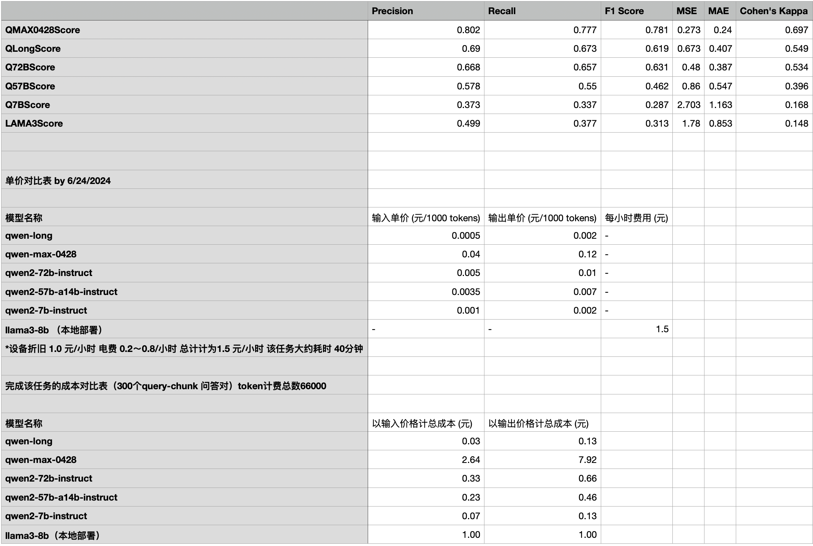

## 从Pipeline到端到端——Transformer模型与开源生态的演进
## From Pipeline to End-to-End—The Evolution of Transformer Models and the Open Source Ecosystem

---

### 从“Pipeline”到“端到端”：基于transformer模型的Token流生产（Imagenet和AlexNet@2012，深度学习革命

### NLP pipeline

- **文本预处理**：分词、去除停用词、词性标注等；
- **特征提取**：将文本转换为数值表示（如 TF-IDF、词袋模型、词向量等）；
- **模型训练**：基于提取的特征训练机器学习模型；
- **后处理**：根据模型输出进行额外的处理（如解码等）

**模块化**：各个步骤相对独立，可以针对每个步骤进行优化。

**可解释性强**：每个步骤的处理过程是透明的，可以清楚地理解每个模块的作用。

### End2End

- **直接优化最终目标**：端到端模型的训练目标直接与最终任务（如分类准确率、翻译质量等）相关联，避免了传统 Pipeline 中中间步骤的手动设计和优化；
- **减少中间误差传播**：传统的 Pipeline 方法中，各个独立步骤之间的误差可能会相互累积，而端到端方法则将整个流程作为一个整体进行优化，减少了误差的传播和累积；
- **自动学习特征**：端到端模型通常使用深度学习技术，能够自动从数据中学习到有效的特征表示，省去了手动特征工程的步骤。

**Bert -> GPT**

#### 重要概念解释

- **Token**：在自然语言处理中，Token通常指的是文本中的基本单元，如单词、子词或字符。Tokenization（分词）是将连续的文本切分成这些基本单元的过程，是文本预处理的第一步。

- **Transformer**：一种基于自注意力机制（Self-Attention）的深度学习模型架构，广泛应用于自然语言处理任务。Transformer模型能够高效地捕捉序列中各个位置之间的依赖关系，克服了传统RNN模型在处理长序列时的局限性。

- **Inference（推理）**：在深度学习中，推理是指使用训练好的模型对新数据进行预测或生成输出的过程。在Transformer模型中，推理过程涉及多个组件，包括自注意力机制和前馈神经网络（FFN）。FFN在每个Transformer层中对经过自注意力机制处理后的表示进行非线性变换，进一步提取和增强特征。在推理过程中，FFN的高效计算能力确保了模型能够快速生成准确的输出。

- **FFN（FeedForward Network，前馈神经网络）**：Transformer中的一个组成部分，通常由两层线性变换和一个激活函数组成。FFN在每个Transformer层中独立作用于每个位置的表示，负责对特征进行非线性变换。

- **推理与FFN的关系**：在Transformer架构中，FFN是每个Transformer层的重要组成部分。推理过程中，输入数据首先通过自注意力机制捕捉序列中各位置的依赖关系，随后通过FFN进行非线性变换，以增强和提取更高级别的特征表示。FFN的存在使得模型能够在推理阶段更好地处理复杂的模式和关系，从而提高预测和生成的质量。

- **Loss Function（损失函数）**：用于衡量模型预测结果与真实值之间差异的函数。常见的损失函数包括均方误差（MSE）、交叉熵损失等。损失函数是模型训练过程中优化的目标。

- **BP（Backpropagation，反向传播）**：一种用于训练神经网络的算法，通过计算损失函数相对于网络参数的梯度，并使用这些梯度来更新参数，以最小化损失函数。

- **Derivative（导数）**：数学中的一个概念，表示函数在某一点的变化率。在深度学习中，导数用于计算梯度，以指导参数更新的方向和步长。

- **Gradient Descent（梯度下降）**：一种优化算法，通过迭代地沿着损失函数梯度的负方向更新模型参数，以寻找损失函数的最小值。梯度下降有多种变种，如批量梯度下降、小批量梯度下降和随机梯度下降（SGD）。

  
### GraphCast (DeepMind，GNN) 10日天气预测 [https://github.com/google-deepmind/graphcast](https://github.com/google-deepmind/graphcast)

- **准确性**超过了业界公认的高标准的欧洲中期天气预报中心（ECMWF）的高分辨率天气模拟系统（HRES）
- **GraphCast进行10天的预测仅需不到一分钟的时间**，传统方法如HRES可能需要数小时的超级计算机计算

### ChatGPT4上线（2023.2）：调研、编码与论文重现（知识储备是使用说明书，不足迭代弥补）

- **科研灵感发现** - 专家访谈
- **Coding** - first pass rate 80 ～90%（single app）+ Claude（cross check）
- **Study reproduction** - 80% time saved

### Y.LeCun, META, 2023.9.9

### 开源社区的蓬勃发展，以github为例：

- **LLMs模型的一键下载部署与训练**：[LLaMA-Factory](https://github.com/hiyouga/LLaMA-Factory/blob/main/README_zh.md)
- **LLMs高速推理服务引擎**：[vLLM](https://github.com/vllm-project/vllm)
- **企业级LLMs中间件及RAG/Agent应用框架**：[Langchain-Chatchat](https://github.com/chatchat-space/Langchain-Chatchat)
- **开源数据标注工具**：[awesome-open-data-annotation](https://github.com/leiMizzou/awesome-open-data-annotation)
- **编程伴侣**：Github Copilot，Cursor AI
- **EHR数据分析工具**：
  - [ehrapy](https://github.com/theislab/ehrapy)
  - [Nature Article](https://www.nature.com/articles/s41591-024-03214-0)
- **各种内容精选**：[StarryDivineSky](https://github.com/wuwenjie1992/StarryDivineSky)
- **GenAI项目的快速增加**
- **中文医疗信息处理评测基准CBLUE数据集**：
  - [数据集](https://tianchi.aliyun.com/dataset/95414) 
  - [GitHub链接](https://github.com/CBLUEbenchmark/CBLUE)

### GenAI技术生态与临床医疗场景有众多结合可能
- 本质是用数学方法对人类文本语义进行压缩和还原
  - 信息获取、处理、分析、生成
  - 场景关键信息的获取
- 法规、政策、制度、技术
  - 合作伙伴与竞争对手，熟人社会的摩擦成本
- 技术成熟度
  - 门槛降低天花板并未显著提高
  - 大模型推理成本高于小模型若干个数量级，边际成本因项目而异
  - 技术更新淘汰倍速提升，团队易陷于无限雕花境地，创造和优化被头部公司删除/短接的环节
- 产品
  - 场景应用数据的获取很关键
  - 上限提升但不显著，AI进入门槛大幅降低竞争激烈，短期拼价格，盈利不乐观
  - 技术上利用好开源社区资源，产品需创造差异性

### 医疗信息化业务应用角度

- **电力 > 算力 > 基础模型 > 应用**（王坚博士三个不等式）- 需求非供应稀缺
- **GenAI重构**，工作效率提高3～5倍，知识技能利用门槛大幅降低，重点在优化工作流
- **院内项目**，低门槛启动，四位数的训推一体机可支持300亿开源LLMs部署，大厂API更省（百万Tokon/元级别）
- **ChatGPT平替装机宝典** [链接](https://mp.weixin.qq.com/s/p49KXh9cGich6D40J0bc5Q)
- **Page Copilot**
- **Prompt Engineering > RAG > AI Search > Agent > Finetune**
- **通用 vs 垂直**，小模型（<3B）finetune是例外
- **中文医疗信息处理评测基准** CBLUE数据集
- **八成的选择，两成的价格**

### 教育（从Zero到Hero）

- **魔法**，取其精髓去其糟粕
- **GenAI App + B站**（李沐读论文系列）+ **开源托管网站**（项目入群）
- **广度优先于深度**（仅供参考），尽量不要重新发明轮子，电机，沙发，彩电，大冰箱
- **Learn by Doing** && **学习小组** && **分享交流**

### 陶艺课的故事

### ChatGPT解读这段文字背后的含义

### Q&A, Thanks!
